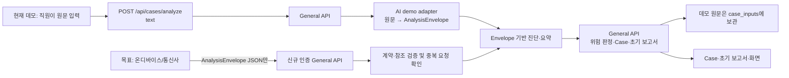

# 온디바이스·통신사 분석 데이터 연동 안내

최종 대조: 2026-09-30

## 먼저 볼 결론

CSR에는 통화 원문이나 녹음 파일 대신, 업체가 화자와 사건 정황을 분해한 버전 명시 JSON인 **`AnalysisEnvelope`**를 전달하는 구조가 이미 설계되어 있습니다. Envelope에는 발화 순서·화자 역할·정규화 요약, 사칭·행동·금전 이벤트, 의미 단위(semantic atom), 인물·기관 등 언급, 의미 간 관계, 구조화 피처가 들어갑니다.

CSR은 이 구조를 검증하고 사건 위험을 계산하며, 빠진 관계·복합 신호·사건 요약·초기 보고서를 만듭니다. 따라서 업체에는 **현재 `DiagnosisResult`나 Case를 통째로 만들라고 하기보다, 원문을 CSR에 보내지 않고 `AnalysisEnvelope`를 생성해 전달하도록** 요청하는 것이 맞습니다.

현재는 이 계약을 외부에서 제출할 General API가 없습니다. 브라우저의 데모 텍스트 분석은 CSR 내부 데모 어댑터가 Envelope를 만들고, 저장 시에는 데모 원문도 보관합니다. 이 문서는 현행 스키마와 흐름, 그리고 별도 구현이 필요한 업체 연동 계약을 구분합니다.

## 현재 구현과 목표 연동



| 단계 | 현재 코드 | 실제 역할 |
|---|---|---|
| 화면 입력 | [`frontend/src/api/cases.ts`](../frontend/src/api/cases.ts) | `POST /api/cases/analyze`에 원문 `text`를 보냄 |
| 공개 분석 API | [`backend/general_api/app/main.py`](../backend/general_api/app/main.py) 및 [`backend/contracts/public_api/case_analyze.py`](../backend/contracts/public_api/case_analyze.py) | 현재 요청은 `text`, `background_completion`, `client_request_id`만 받음. 엄격한 스키마라 Envelope 필드는 거부됨 |
| 데모 원문 분해 | [`backend/ai_api/app/domains/diagnosis/service.py`](../backend/ai_api/app/domains/diagnosis/service.py), [`extractor.py`](../backend/ai_api/app/domains/diagnosis/extractor.py), [`semantic_atoms.py`](../backend/ai_api/app/domains/diagnosis/semantic_atoms.py), [`context_features.py`](../backend/ai_api/app/domains/diagnosis/context_features.py), [`envelope.py`](../backend/ai_api/app/domains/diagnosis/envelope.py) | 데모에서 화자/이벤트/피처/atom을 만들고 `AnalysisEnvelope`로 변환 |
| Envelope 진단 | [`backend/ai_api/app/main.py`](../backend/ai_api/app/main.py), [`backend/ai_api/app/domains/diagnosis/service.py`](../backend/ai_api/app/domains/diagnosis/service.py) | 내부 `POST /ai/analyze/signals`가 Envelope를 받아 역할·alias 정리, 관계·복합 신호·episode·action group·entity registry·감사 및 진단 narrative를 계산 |
| CSR용 결과 정리 | [`backend/general_api/app/domains/cases/signal_projection.py`](../backend/general_api/app/domains/cases/signal_projection.py) | 저장 전 원문 문장이나 원문 evidence를 정규화 라벨로 치환하고 Context 입력을 구조화 결과로 제한 |
| Case 생성·보고서 | [`backend/general_api/app/domains/cases/service.py`](../backend/general_api/app/domains/cases/service.py), `initial_report.py` | 부분 실패는 Case 생성에 쓰지 않음. 정상 판정이면 기본적으로 `NO_CASE`, 그 외에는 Case와 초기 보고서를 만듦 |
| 저장 | [`backend/general_api/app/domains/cases/mysql_repository.py`](../backend/general_api/app/domains/cases/mysql_repository.py) | Case/진단 JSON, 분석 구간, 수치 피처, semantic atom/relation/context signal, 보고서를 저장. 데모 경로는 `case_inputs.input_text`도 저장 |

### 원문을 분해하고 다시 조립하는 흐름

1. **분해(현재 데모만)**: 텍스트를 발화 구간으로 나누고, 이벤트와 문맥 피처를 찾고, 사건별 의미 단위인 `SemanticAtom`을 만듭니다. 원문은 업체의 온디바이스 분석기나 데모 adapter 안에서만 사용해야 하는 목표입니다.
2. **Envelope 구성**: 발화/이벤트/atom/mention/relation/피처를 turn ID와 atom ID로 연결합니다. 원문 문장 대신 정규화 요약과 코드·라벨을 전달합니다.
3. **CSR에서 구조 파생**: 기존 AI 서비스가 이벤트로부터 window와 수치 피처를 재구성하고, atom으로부터 역할 귀속·별칭·관계·복합 신호·대화 episode·행동 그룹·entity registry를 만듭니다. 업체가 이 CSR 내부 산출물까지 만들 필요는 없습니다.
4. **사건 설명 생성**: CSR은 구조화된 payload로 짧은 사건 요약, 주장·요구·전술, 고객 진술과 다음 확인 항목을 생성합니다. 운영 목표 경로는 저장 원문을 이 단계에 다시 넣지 않습니다.
5. **Case 판정·저장**: General API가 부분 실패를 막고 위험도를 기준으로 Case 생성 여부를 정하며, 초기 보고서를 만들고 구조화 결과를 저장합니다.

## 현재 `AnalysisEnvelope` v1 데이터 계약

실제 모델은 [`backend/contracts/diagnosis.py`](../backend/contracts/diagnosis.py)의 `AnalysisEnvelope` 및 하위 모델입니다. Pydantic `extra="forbid"`이므로 v1에 정의되지 않은 추가 필드를 넣으면 안 됩니다.

모델 validator만 보면 최상위에서 `source`, `turn_count`, `turns`가 필수이고 나머지 배열은 비어 있을 수 있습니다. 다만 이벤트와 의미 구조가 모두 비면 CSR의 위험 판정과 사건 설명에 필요한 근거가 부족합니다. **업체 연동 수용 기준은 실제 위험 정황이 있는 경우 최소 1개 이상 event/atom과 turn 연결을 요구하고, 탐지 내용이 없는 경우에만 빈 배열을 허용**하도록 정해야 합니다. 이는 현재 Pydantic 필수 조건과 구분되는 운영 수용 규칙입니다.

### 최상위 필드

| 필드 | 자료형·제약 | 의미 |
|---|---|---|
| `schema_version` | 고정 문자열 `analysis-envelope.v1` | 계약 버전 |
| `source` | `ON_DEVICE`, `TELECOM`, `ASAP`, `FDS`, `DEMO_ADAPTER` | 분석 출처. 통신사는 `TELECOM`, 휴대폰 내 분석은 `ON_DEVICE` 사용 가능 |
| `source_reference` | 문자열, 최대 128자, 선택 | 업체 측 작업/분석 참조 ID. 고객 전화번호나 transcript를 넣지 말 것 |
| `reference_time` | 문자열, 최대 64자, 선택 | 해당 통화/자료의 기준 시각(ISO 8601 권장) |
| `timezone` | 문자열, 기본 `Asia/Seoul` | `reference_time` 및 상대 시각 해석 기준 |
| `source_text_included` | 반드시 `false` | 원문 미포함 표시 |
| `extraction_warnings` | 문자열 배열, 최대 100개 | 누락·저신뢰 항목의 짧은 코드/설명. 원문 인용은 금지 |
| `turn_count` | 정수 1–180 | 대화 turn 수 메타데이터 |
| `turns` | 필수 배열 1–120개 | 발화 구간. 세부 구조는 아래 참조 |
| `events` | 배열 0–500개 | 위험 사건의 정규화 분류 |
| `semantic_atoms` | 배열 0–1,000개 | 추론 근거가 되는 최소 의미 단위 |
| `semantic_mentions` | 배열 0–2,000개 | 정규화된 기관·인물·행동·금액 등의 언급 |
| `semantic_relations` | 배열 0–2,000개 | 의미 단위 간 관계 |
| `context_features` | `CaseContextFeatures`, 기본 빈 구조 | 주장·요구 행동·전술·노출·금액·시간 등 분류 피처 |

### 하위 데이터 구조

| 객체 | 주요 필드 | 업체가 표현해야 할 의미 |
|---|---|---|
| `StructuredTurn` | `turn_id`, `sequence_index`, `speaker_role`, `speaker_confidence`, `speech_act`, `normalized_summary`, `occurred_at` | 누가 어느 순서에서 무엇을 했는지. 역할은 `SUSPECTED_PARTY`, `CUSTOMER`, `BANK_STAFF`, `SYSTEM`, `UNKNOWN`. `normalized_summary`는 최대 320자의 정규화된 짧은 요약이지 발화 원문/인용문이 아님 |
| `AnalysisSignalEvent` | `event_id`, `event_family`, `subtype`, `impersonation_group`, `source_turn_id`, `normalized_label`, 역할 4종, `amount_krw`, `is_requested`, `occurrence_count`, `confidence` | `IMPERSONATION`, `PSY_STRATEGY`, `ACTION_REQUEST`, `MONEY_MOVEMENT`, `AMOUNT` 중 하나로 정규화한 위험 사건. 사건이 “요청/주장”된 것과 고객이 실제 행동한 것을 구별 |
| `SemanticAtom` | ID/분류, `speaker`, `subject`, `predicate`, `actor`, `target`, `object`, `destination`, `action_state`, `modality`, `polarity`, `claim_status`, `source_turn_id`, `source_event_id`, `semantic_fingerprint` | 독립적으로 확인 가능한 하나의 뜻. 예: “상대가 기관 담당자라고 주장함”, “상대가 앱 설치를 요구함”, “고객은 실제 설치 여부를 모름”. `action_state`는 `MENTIONED`, `REQUESTED`, `INSTRUCTED`, `PLANNED`, `ATTEMPTED`, `REPORTED_ACTION`, `VERIFIED`, `COMPLETED`, `FAILED`, `CANCELLED`, `DENIED`, `UNKNOWN` 중 하나 |
| `SemanticAtom`의 세부 분류 | `speaker_role`, `actor_role`, `target_role`, `reported_by_role`, 각 confidence; pressure·threat·communication control 필드; 인증정보 유형; amount role/value/direction; 주장 기관·지점·인물·직책·관계·목적; deadline·횟수 | 사건 재구성과 후속 질문/확인에 필요한 속성. 확인되지 않은 금액·인물·실행 결과는 추측해서 채우지 말고 비우거나 `UNKNOWN`으로 표현 |
| `SemanticMention` | `mention_id`, `normalized_code`, `normalized_value`, `mention_type`, `source_turn_id`, `sequence_index`, `speaker_role`, occurrence/turn 범위, `confidence` | atom/turn에 나타난 기관, 조직, 인물, 역할, 관계, 호칭, 행동, 목적, 금액, 기한, 위치, 기기, 연락처 등의 정규화된 값 |
| `SemanticRelation` | `relation_id`, `relation_type`, `source_atom_id`, `target_atom_id`, `confidence`, `derivation` | atom 사이의 `SUPPORTS`, `JUSTIFIES`, `REQUIRES`, `CAUSES`, `CONDITIONAL_ON`, `CONTRADICTS` 관계. `derivation`은 `DETERMINISTIC_ATOM_RULE` 또는 `LLM_VERIFIED` |
| `CaseContextFeatures` | `claimed_actor_types`, `claim_codes`, `requested_action_codes`, `manipulation_tactic_codes`, `exposure_risk_codes`, 금액 배열, `chronology`, `unknown_fields`, `source`, `schema_version`, `observations`, `extraction_method` | CSR의 독립 진단에 필요한 ML 비종속 요약 피처. `source`는 고정값 `STRUCTURED_CONTEXT_FEATURES_ONLY`. `observations`는 현재 임의 dict 배열이므로 v1 업체 전달에서는 비워 두거나 사전 합의한 allowlist만 사용 |

**CSR가 뒤에 만드는 결과**: `context_signals`, `conversation_episodes`, `action_groups`, `entity_registry`, `semantic_audit`, `quality_reviews`, 위험 점수/등급, `ContextResult`, `DiagnosisResult`, Case ID, 초기 보고서는 현재 `AnalysisEnvelope` 제출 필드가 아닙니다. 이들은 Envelope를 소비한 AI/General API 결과입니다.

### v1 예시

아래는 실제 모델에서 받을 수 있는 축약 예시입니다. 기관명은 예시용 가명입니다. 원문 인용, 녹취 문장, 계좌·전화번호·OTP 값은 포함하지 않습니다.

```json
{
  "schema_version": "analysis-envelope.v1",
  "source": "TELECOM",
  "source_reference": "provider-job-7f3c2a",
  "reference_time": "2026-09-30T16:20:00+09:00",
  "timezone": "Asia/Seoul",
  "source_text_included": false,
  "extraction_warnings": ["CUSTOMER_ACTION_STATUS_UNCONFIRMED"],
  "turn_count": 2,
  "turns": [
    {
      "turn_id": 1,
      "sequence_index": 1,
      "speaker_role": "SUSPECTED_PARTY",
      "speaker_confidence": 0.94,
      "speech_act": "ASSERTION_AND_REQUEST",
      "normalized_summary": "대출회사 담당자라고 주장하고 상환 명목의 송금과 앱 설치를 요구함",
      "occurred_at": "2026-09-30T16:19:42+09:00"
    },
    {
      "turn_id": 2,
      "sequence_index": 2,
      "speaker_role": "CUSTOMER",
      "speaker_confidence": 0.98,
      "speech_act": "UNCERTAINTY_REPORT",
      "normalized_summary": "고객은 실제 송금 및 앱 설치 여부를 아직 확인하지 못함",
      "occurred_at": "2026-09-30T16:19:55+09:00"
    }
  ],
  "events": [
    {
      "event_id": "EVT-0001",
      "event_family": "IMPERSONATION",
      "subtype": "CLAIMS_LOAN_COMPANY",
      "source_turn_id": 1,
      "normalized_label": "대출회사 담당자 사칭 주장",
      "speaker_role": "SUSPECTED_PARTY",
      "actor_role": "SUSPECTED_PARTY",
      "target_role": "CUSTOMER",
      "reported_by_role": "SUSPECTED_PARTY",
      "confidence": 0.91
    },
    {
      "event_id": "EVT-0002",
      "event_family": "MONEY_MOVEMENT",
      "subtype": "TRANSFER",
      "source_turn_id": 1,
      "normalized_label": "상환 명목의 외부 계좌 송금 요구",
      "speaker_role": "SUSPECTED_PARTY",
      "actor_role": "SUSPECTED_PARTY",
      "target_role": "CUSTOMER",
      "reported_by_role": "SUSPECTED_PARTY",
      "is_requested": true,
      "confidence": 0.93
    },
    {
      "event_id": "EVT-0003",
      "event_family": "ACTION_REQUEST",
      "subtype": "INSTALL_APP",
      "source_turn_id": 1,
      "normalized_label": "앱 설치 요구",
      "speaker_role": "SUSPECTED_PARTY",
      "actor_role": "SUSPECTED_PARTY",
      "target_role": "CUSTOMER",
      "reported_by_role": "SUSPECTED_PARTY",
      "is_requested": true,
      "confidence": 0.96
    }
  ],
  "semantic_atoms": [
    {
      "atom_id": "ATM-0001",
      "atom_class": "IDENTITY_CLAIM",
      "speaker": "SUSPECTED_PARTY",
      "predicate": "CLAIMS_ORGANIZATION",
      "actor": "SUSPECTED_PARTY",
      "target": "CUSTOMER",
      "object": "대출회사 담당자",
      "action_state": "MENTIONED",
      "claim_status": "UNVERIFIED",
      "claimed_organization": "LOAN_COMPANY",
      "claimed_organization_name": "한빛대출",
      "speaker_role": "SUSPECTED_PARTY",
      "actor_role": "SUSPECTED_PARTY",
      "target_role": "CUSTOMER",
      "reported_by_role": "SUSPECTED_PARTY",
      "source_event_id": "EVT-0001",
      "source_turn_id": 1,
      "semantic_fingerprint": "identity.claims_organization.loan_company"
    },
    {
      "atom_id": "ATM-0002",
      "atom_class": "MONEY_ACTION",
      "speaker": "SUSPECTED_PARTY",
      "predicate": "TRANSFER_FUNDS",
      "actor": "SUSPECTED_PARTY",
      "target": "CUSTOMER",
      "object": "상환금",
      "destination": "외부 계좌",
      "action_state": "REQUESTED",
      "modality": "REQUEST",
      "claim_status": "UNVERIFIED",
      "amount_role": "REQUESTED_AMOUNT",
      "amount_direction": "REQUEST",
      "claimed_purpose": "상환",
      "speaker_role": "SUSPECTED_PARTY",
      "actor_role": "SUSPECTED_PARTY",
      "target_role": "CUSTOMER",
      "reported_by_role": "SUSPECTED_PARTY",
      "source_event_id": "EVT-0002",
      "source_turn_id": 1,
      "semantic_fingerprint": "money.transfer.requested.repayment"
    },
    {
      "atom_id": "ATM-0003",
      "atom_class": "DEVICE_ACTION",
      "speaker": "SUSPECTED_PARTY",
      "predicate": "INSTALL_APP",
      "actor": "SUSPECTED_PARTY",
      "target": "CUSTOMER",
      "action_state": "REQUESTED",
      "modality": "REQUEST",
      "claim_status": "UNVERIFIED",
      "speaker_role": "SUSPECTED_PARTY",
      "actor_role": "SUSPECTED_PARTY",
      "target_role": "CUSTOMER",
      "reported_by_role": "SUSPECTED_PARTY",
      "source_event_id": "EVT-0003",
      "source_turn_id": 1,
      "semantic_fingerprint": "device.install_app.requested"
    },
    {
      "atom_id": "ATM-0004",
      "atom_class": "CUSTOMER_REPORT",
      "speaker": "CUSTOMER",
      "predicate": "ACTION_STATUS_UNCONFIRMED",
      "actor": "CUSTOMER",
      "target": "CUSTOMER",
      "action_state": "UNKNOWN",
      "claim_status": "CUSTOMER_REPORTED",
      "speaker_role": "CUSTOMER",
      "actor_role": "CUSTOMER",
      "target_role": "CUSTOMER",
      "reported_by_role": "CUSTOMER",
      "source_turn_id": 2,
      "semantic_fingerprint": "customer.action_status.unknown"
    }
  ],
  "semantic_mentions": [
    {
      "mention_id": "MEN-0001",
      "normalized_code": "CLAIMED_ORGANIZATION_NAME",
      "normalized_value": "한빛대출",
      "mention_type": "INSTITUTION",
      "source_turn_id": 1,
      "sequence_index": 1,
      "speaker_role": "SUSPECTED_PARTY",
      "occurrence_count": 1,
      "first_turn_id": 1,
      "last_turn_id": 1,
      "confidence": 0.88
    },
    {
      "mention_id": "MEN-0002",
      "normalized_code": "ACTION_INSTALL_APP",
      "normalized_value": "앱 설치",
      "mention_type": "ACTION",
      "source_turn_id": 1,
      "sequence_index": 2,
      "speaker_role": "SUSPECTED_PARTY",
      "occurrence_count": 1,
      "first_turn_id": 1,
      "last_turn_id": 1,
      "confidence": 0.96
    }
  ],
  "semantic_relations": [
    {
      "relation_id": "REL-0001",
      "relation_type": "JUSTIFIES",
      "source_atom_id": "ATM-0001",
      "target_atom_id": "ATM-0002",
      "confidence": 0.82,
      "derivation": "DETERMINISTIC_ATOM_RULE"
    }
  ],
  "context_features": {
    "claimed_actor_types": ["LOAN_COMPANY"],
    "claim_codes": ["CLAIMS_LOAN_COMPANY_AFFILIATION"],
    "requested_action_codes": ["TRANSFER_FUNDS", "INSTALL_APP"],
    "manipulation_tactic_codes": [],
    "exposure_risk_codes": ["MONEY_TRANSFER_REQUEST", "REMOTE_APP_INSTALL_REQUEST"],
    "amount_values_krw": [],
    "requested_amount_values_krw": [],
    "chronology": ["TURN_1_IDENTITY_CLAIM", "TURN_1_TRANSFER_REQUEST", "TURN_1_APP_INSTALL_REQUEST", "TURN_2_CUSTOMER_UNSURE"],
    "unknown_fields": ["actual_transfer_status", "actual_app_install_status"],
    "source": "STRUCTURED_CONTEXT_FEATURES_ONLY",
    "schema_version": "case_context_features.v1",
    "observations": [],
    "extraction_method": "EVENT_DERIVED"
  }
}
```

### 현재 v1에서 검증되는 참조

- `turn_id`는 중복일 수 없고 `turn_count` 이하여야 합니다.
- Event, atom, mention의 `source_turn_id`는 실제 `turns` 안에 있어야 합니다.
- `atom_id`는 중복일 수 없습니다.
- Relation의 양쪽 atom ID는 모두 실제 `semantic_atoms` 안에 있어야 합니다.
- 다만 현재 validator는 `event_id`·`mention_id`·`relation_id`의 중복이나 `atom.source_event_id` 연결까지 검증하지 않습니다. 외부 연동 전 보강할 검증 항목입니다.

## 업체에 요청할 것

업체 업무 범위는 다음 산출물을 만드는 것으로 한정하는 것이 좋습니다.

1. 통화/텍스트 원문을 기기 또는 업체가 합의한 분석 경계 안에서 처리합니다.
2. 한국어 turn 분할과 화자 역할/신뢰도를 제공합니다. 역할이 애매하면 `UNKNOWN`으로 둡니다.
3. 사칭 주장, 압박, 요구 행동, 금전 이동/금액을 분류하고 각각의 요청·실행·보고·확인 상태를 분리합니다.
4. 사건 재구성에 필요한 atom, mention, relation, context feature를 v1 계약에 맞춰 출력합니다.
5. 원문 문장, 원문 구간 인용, 음성, 연락처·계좌·인증정보 값을 Envelope에 넣지 않습니다. 필요한 기관 확인용 명칭은 정책에 합의한 최소 범위만 전달합니다.
6. 각 결과에 confidence, 정규화 코드, 출처 turn/ID, 경고를 붙이고, 확인되지 않은 것은 사실로 승격하지 않습니다.
7. 계약 검증용 샘플과 아래 수용 시험 결과를 제출합니다.

### 수용 시험

- 기관 사칭 주장과 실제 기관 확인을 구분한다.
- 상대의 송금/설치/인증정보 요청과 고객의 실제 수행 여부를 구분한다. “모름”을 “완료”로 만들지 않는다.
- 부정·정정·반복 언급·여러 화자의 발언에서 turn 연결이 일관된다.
- 금액이 송금 요구액인지 실제 피해액인지 역할/방향으로 구분한다.
- 모든 Event/atom/mention이 유효한 turn에 연결되고 모든 Relation이 유효 atom을 가리킨다.
- 원문/긴 인용문/녹음·개인 식별자 누출 여부를 자동 검사한다.
- 개인정보·저장 기간·전송 암호화·업체 로그/학습 사용 여부를 계약과 보안 검토에서 확정한다.

## 권장 전송 방식과 CSR 응답

### 권장: 업체가 Envelope를 만들어 인증된 General API에 제출

업체는 `application/json; charset=utf-8`로 Envelope를 제출합니다. 공개 분석 API와 별도로 **새로운 인증된 General API ingestion endpoint**를 구현해야 합니다. 예를 들어 `POST /api/cases/analyze-envelope`를 둘 수 있습니다. 이 경로 이름과 아래 wrapper는 **제안이며 현재 구현되어 있지 않습니다**.

요청 body는 제안 wrapper로 다음 세 값을 전달합니다. `envelope` 값에는 위 v1 예시의 축약본이 아니라 실제 전체 `AnalysisEnvelope` 객체가 들어갑니다.

```text
{
  "schema_version": "case-analysis-submission.v1",
  "client_request_id": "provider-stable-uuid-for-retries",
  "envelope": <전체 AnalysisEnvelope v1 객체>
}
```

업체 인증은 payload의 `source` 문자열을 신뢰하지 말고 HTTP 인증서/서비스 계정으로 판별해야 합니다. 전송은 TLS 기반으로 하고 서비스 간 연동이면 mTLS 또는 동등한 인증을 보안 설계에서 선택합니다. 재시도에는 같은 `client_request_id`를 사용해 중복 Case 생성을 막습니다.

업체는 **AI API에 직접 보내지 않습니다**. `/ai/analyze/signals`는 현재 내부 AI endpoint이고, 진단 결과를 반환할 뿐 Case/보고서 저장이나 공개 API 인증·요청 중복 처리를 담당하지 않습니다. General API가 인증, 요청 ID 중복 확인, Envelope 검증, AI 호출, 결과 저장과 Case 생성을 조정해야 합니다.

현재 Public API의 응답 모델은 [`PublicAnalyzeCaseResponse`](../backend/contracts/public_api/case_analyze.py)이며 최소한 `disposition`(`CASE_CREATED`/`NO_CASE`/`FAILED`), `case_id`, `risk`, `initial_brief`, `analysis_status`, `initial_report` 참조 또는 오류를 반환합니다. 새 ingestion endpoint 응답은 이 공개 응답 계약을 재사용하거나 버전 관리해 명시해야 합니다. 전체 transcript나 내부 `DiagnosisResult`를 업체에 되돌려줄 필요는 없습니다.

### 업체가 원문만 전달하는 경우

현행 `POST /api/cases/analyze`가 받는 방식이지만 데모 텍스트 경로입니다. 이는 원문을 CSR에 전달하고 현재 General API가 `case_inputs.input_text`에 저장하는 흐름입니다. 온디바이스 privacy 경계를 만족하지 않으며 운영 연동 계약으로 권장하지 않습니다. 이 방식을 선택하려면 별도 법무·보안 승인, 입력/로그/저장·삭제·접근 정책과 API 명세가 먼저 필요합니다.

### 업체가 SDK만 제공하는 경우

SDK가 원문을 처리하는 실행 위치/프로세스와 데이터 경계를 먼저 합의하고, SDK 출력은 업체 API 경로와 동일한 `AnalysisEnvelope`로 고정할 수 있습니다. CSR이 SDK 결과를 소비하더라도 CSR로 넘어가는 데이터 모양은 동일해야 품질 평가·저장·모델 교체가 가능합니다.

## 실제 연동 전에 필요한 CSR 변경

이 부분은 현행 코드에 이미 끝난 기능이 아니라, Envelope 직접 제출을 위해 필요한 구현입니다.

- `PublicAnalyzeCaseRequest`와 다른 신규 Request DTO로 Envelope 및 `client_request_id`를 검증하고, 외부 업체 인증·권한·요청 크기 제한·재시도/멱등 처리를 구현합니다.
- `AnalyzeCaseService`/`DiagnosisAiClient`에 `AnalysisEnvelope` 입력 경로를 추가합니다. 현재 General API client는 `AnalyzeTextRequest`만 받고 `/ai/analyze/text`를 호출합니다.
- AI 결과가 완전하고 유효한지 검증한 뒤 기존 Case 판정·보고서 생성 흐름에 연결합니다. vendor 입력은 현재 `NO_CASE`/`CASE_CREATED` 정책을 우회하지 않아야 합니다.
- **원문 없는 저장 경로를 추가합니다.** 현재 MySQL `case_inputs.input_text`가 `NOT NULL`이고 `mysql_repository.create()`가 매번 입력 원문을 insert합니다. Envelope-only 경로가 이 컬럼에 placeholder/정규화 문장을 원문처럼 넣어서는 안 됩니다. 원문 없는 Case에서는 `case_inputs` 행을 생략하고, 필요하면 별도의 비민감 provenance 메타데이터를 저장하도록 repository/schema를 변경해야 합니다.
- 현재 Envelope validator가 보장하지 않는 이벤트/mention/relation ID 유일성, atom-event 참조, 코드 allowlist, 중첩 자유 텍스트/개인정보 유출 검사를 보완합니다.
- `CaseContextFeatures.observations`는 현재 임의 dict라 깊은 필드 검증이 없습니다. v1 업체 전달에서는 비워 두거나 CSR가 허용하는 명시 allowlist만 사용하도록 별도 보강해야 합니다.
- Turn에는 현재 오디오/원문 타임스탬프(offset) 필드가 없습니다. UI에서 근거 구간으로 이동하거나 원본 통화의 특정 부분과 대조해야 한다면 원문을 반환하지 않는 `start_offset_ms`/`end_offset_ms` 같은 근거 위치 필드를 후속 버전에서 정의해야 합니다. v1에 임의 필드로 보내면 strict validation에서 거부됩니다.
- 크기 제한도 계약상 고정해야 합니다. `turn_count`는 최대 180이지만 `turns`는 최대 120이며, 다중 통화/장시간 자료 처리 방식은 정의돼 있지 않습니다. 누락 turn을 조용히 버리지 말고 분할/요약 정책과 누락 경고를 업체 계약 전에 결정해야 합니다.
- 스키마 변경은 현재 `analysis-envelope.v1`의 strict reader를 깨지 않도록 새 버전과 명시적 호환/전환 절차로 배포합니다.

## 데이터 보호 기준

- 업체→CSR payload의 기본값은 **원문/음성 미전송**입니다. `source_text_included`는 `false`여야 하며 transcript 필드를 임의로 추가하면 안 됩니다.
- `normalized_summary`, `normalized_label`, `lexical_cues`, `observed_terms`, atom의 이름/값, context `observations`도 문자열을 담을 수 있습니다. 전체 발화 복사나 녹취 인용을 넣지 말고 짧은 의미 요약/정규화 명칭으로 제한합니다. 현재 스키마의 `source_text_included=false` 표시는 내용 자체를 완벽히 검사해 주지 않습니다.
- `source_reference`에는 업체 쪽 불투명 참조값을 사용합니다. 원문 SHA-256은 짧거나 예측 가능한 transcript에 대한 사전 대입으로 내용을 추측할 수 있으므로 그대로 운영 식별자로 쓰지 말고, 필요하면 별도 비밀키 기반 참조 설계를 검토합니다. 현재 데모 코드가 SHA-256을 쓰는 것은 데모 구현 사실이지 업체 권장값이 아닙니다.
- OTP, 비밀번호, 전체 카드/계좌번호, 전화번호 등은 사건에 필요한 유형 코드만 전달하고 실제 secret 값은 제외합니다.
- 받은 이벤트/발언은 우선 `CLAIMED`, `REQUESTED`, `REPORTED`, `UNVERIFIED`, `UNKNOWN` 의미를 유지합니다. 별도 거래/기관 확인 없이 `VERIFIED`로 표시하지 않습니다.

## 연동을 시작할 때 업체에 전달할 자료

1. 이 문서와 계약 원본 [`diagnosis.py`](../backend/contracts/diagnosis.py)의 `AnalysisEnvelope`/하위 Pydantic 모델을 전달합니다.
2. v1 필드만 사용한 JSON 샘플, 유효/무효 fixture, 현재 validator의 참조 규칙을 제공합니다.
3. v1에 없는 오디오 offset, 원문 span, 장시간 분할이 필요한 경우 업체가 임의 확장하지 않도록 요구하고, 필요 필드를 먼저 Envelope v2로 설계합니다.
4. 업체가 제출할 품질 자료를 정합니다: 역할/행동 상태/기관 분류 precision-recall, unknown 보존, 개인정보 누출, 다중 화자·부정·정정 평가.
5. API 인증, 요청 ID 멱등성, 최대 body 크기, 타임아웃·재시도, 오류 포맷, 데이터 보존/삭제, 감사 로그를 연동 명세와 운영 책임표에 추가합니다.

## 관련 문서

- [`33_ANALYSIS_ENVELOPE_FREEZE_CONTRACT.md`](33_ANALYSIS_ENVELOPE_FREEZE_CONTRACT.md): 현재 Envelope의 원문/privacy 경계와 불변 조건
- [`34_ANALYSIS_ENVELOPE_INTEGRATION_BACKLOG.md`](34_ANALYSIS_ENVELOPE_INTEGRATION_BACKLOG.md): 실제 외부 연동 전후의 구현 순서
- [`04_PRIVACY_SAFE_SIGNAL_FLOW.md`](04_PRIVACY_SAFE_SIGNAL_FLOW.md): 데모 원문 보관과 지원 AI 비접근 흐름
- [`DB_CATALOG.md`](../database/DB_CATALOG.md): 현행 `case_inputs` 등 DB 구조
