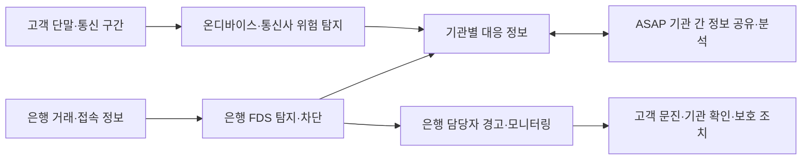
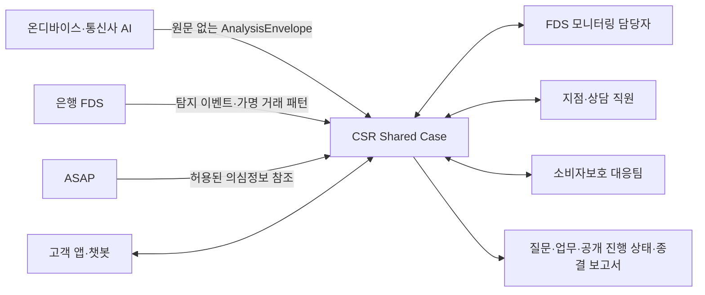
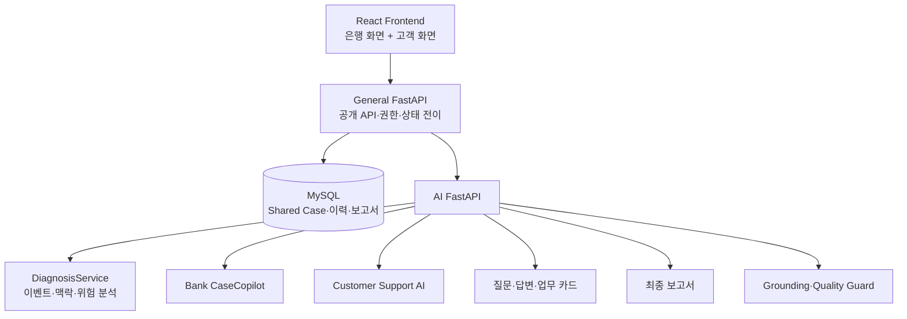

# CSR 공모전 적합성 원고 — 기획·개발·운영 계획 팩트체크

작성 기준일: 2026-09-30  
용도: 프로젝트 제작 결과 보고서 PPT 및 공모전 서류의 `적합성: 기획·개발·운영 계획` 작성용 사실 기준

> 이 문서는 문안 제작용 source of truth다. `현재 구현`, `검증된 결과`, `향후 계획`을 섞어 쓰지 않는다.

## 1. 가장 먼저 고정할 서비스 정의

### 한 문장 정의

CSR(Case Share Room)은 온디바이스 AI·ASAP·은행 FDS가 포착한 위험 신호를 대체하는 탐지 제품이 아니라, 그 신호를 고객 상황의 맥락과 은행의 실제 대응 업무로 연결하는 보이스피싱 공동 대응 워크스페이스다.

### 목적

- 탐지 이후 흩어지는 통화 정황, 거래 위험 신호, 고객 답변, 기관 확인 결과와 담당자 조치를 하나의 Shared Case에 모은다.
- 은행 직원이 짧은 시간 안에 `누가 무엇을 주장했고`, `무엇을 요구했으며`, `고객이 실제로 무엇을 했는지`, `무엇이 아직 미확인인지`를 구분하도록 돕는다.
- 고객·FDS 모니터링 담당자·상담 또는 창구 직원·소비자보호 담당자가 같은 사건의 최신 상태를 이어받도록 한다.
- AI가 결정을 대신하지 않고, 질문·요약·업무 제안·보고서 초안을 제공하며 최종 확인과 외부 조치는 직원이 수행하게 한다.

### 필요성

현행 체계는 각각 중요한 역할을 수행하지만 목적과 데이터 단위가 다르다.

1. 온디바이스 AI는 통화·문자·악성 앱 등 고객 단말 가까이에서 위험 정황을 빠르게 포착할 수 있다.
2. ASAP은 금융·통신·수사 과정에서 확인된 의심정보를 기관 간 공유하고 패턴을 분석하는 공동 대응 인프라다.
3. FDS는 접속정보와 거래내역을 실시간 분석해 비정상·의심거래를 탐지·차단한다.
4. 실제 현장에서는 탐지 신호만으로 고객의 현재 행동, 사칭 주체, 통화 통제, 앱 설치, 인증정보 노출, 추가 송금 위험과 담당자별 다음 행동을 한눈에 설명하기 어렵다.

CSR은 이 마지막 구간을 담당한다. 탐지 결과를 `사건 맥락 → 확인 질문 → 담당자 업무 → 고객 공개 진행 상태 → 종결 보고서`로 연결해 사람이 실행할 수 있는 Case로 전환한다.

## 2. 현행 체계와 CSR의 차별적 역할

| 구분 | 현행 핵심 역할 | CSR이 담당하는 보완 영역 |
|---|---|---|
| 온디바이스·통신사 AI | 단말 또는 통신 구간에서 통화·문자·악성 앱 등 위험 정황 탐지 | 원문 대신 privacy-safe 구조화 신호를 받아 은행 업무 Case로 변환 |
| ASAP | 금융·통신·수사 의심정보의 기관 간 공유와 패턴 분석 | ASAP을 대체하지 않고, 제공 가능한 신호를 사건 근거 및 기관 확인 맥락으로 참조하는 연동 지점 설계 |
| 은행 FDS | 접속정보·거래내역 기반 비정상·의심거래 탐지 및 제한·차단 | FDS 점수를 다시 계산하지 않고 탐지 이후 고객 문진, 사건 맥락, 담당자 조치와 인계 기록을 지원 |
| 기존 경고창·상담 | 위험 알림 또는 개별 상담 수행 | 탐지 이유, 고객 실제 행동, 미확인 항목, 다음 업무, 처리 이력을 하나의 Shared Case에서 지속 관리 |

공식 자료상 FDS는 단순 경고창만 의미하지 않는다. 금융위원회는 FDS를 접속정보와 거래내역을 실시간 분석해 비정상·의심거래를 탐지·차단하는 시스템으로 설명하며, 금융회사가 이체 제한·거래정지를 할 수 있다고 안내한다. 따라서 제안서에는 `FDS는 경고만 보여준다`고 쓰지 않고, `FDS는 거래 이상을 탐지·차단하지만 직원이 고객 정황과 대응 업무를 이어가는 Case 협업 영역은 별도의 문제`라고 쓴다.

또한 ASAP은 CSR과 경쟁하는 제품으로 표현하지 않는다. ASAP은 국가·업권 차원의 정보 공유 인프라이고 CSR은 개별 사건의 사람 중심 대응 오케스트레이션 계층이라는 관계로 설명한다.

## 3. 권장 서술 순서

PPT와 서류에는 다음 순서를 권장한다.

1. 문제 정의: 탐지는 존재하지만 탐지 이후의 맥락 이해·협업·인계가 분절됨
2. 현행 체계: 온디바이스 AI, ASAP, FDS의 역할과 한계
3. 서비스 정의: 탐지 대체가 아닌 Shared Case 기반 대응 오케스트레이션
4. 사용자와 업무 흐름: 고객 → FDS 모니터링 → 상담·창구 → 소비자보호
5. 현재 PoC 구현 결과: 화면, 백엔드, AI, 데이터 계약, 안전 장치
6. 외부 연동 설계: 온디바이스 Envelope, FDS/ASAP read-only adapter, 은행 앱·챗봇
7. 보안·망분리·법적 경계: 원문 비수신, 구조화 신호, 내부망 배포, 직원 승인
8. 검증 결과와 한계: 실제 수치와 미검증 항목
9. 단계별 개발·도입 로드맵
10. 운영 체계와 KPI: 성능, 품질, 안전, 감사, 장애 대응
11. 기대 효과: 대응시간 단축, 누락 감소, 인계 품질과 감사 가능성 향상

## 4. 우리 서비스의 역할과 구조

CSR은 다음 다섯 계층으로 구성한다.

1. 신호 수신 계층: 온디바이스·통신사·ASAP·FDS가 제공하는 구조화 이벤트를 표준 Envelope로 수신한다.
2. 분석 계층: 화자·행위자·대상, 사칭 기관, 요구 행동, 금액, 시간 압박, 통화 통제, 인증정보 노출 등을 독립적인 신호로 구조화하고 관계를 연결한다.
3. Shared Case 계층: 고객 진술, AI 추출, 은행 기록, 공식 확인을 출처별로 구분하고, 미확인 사항·질문·검증·업무·결정 이력을 관리한다.
4. 업무 지원 계층: 은행용 Copilot, 고객용 안전 지원 AI, 질문 추천, 업무 카드, 고객 공개 진행 상태, 종결 보고서를 제공한다.
5. 화면 계층: 은행 사건 목록·Case Room·Context Panel과 고객 공개 채팅·질문 카드·피해구제 안내를 제공한다.

핵심 원칙은 `AI 결과 = 확정 또는 실행`이 아니라 `AI 결과 = 근거가 연결된 제안`이라는 점이다. 실제 업무 완료, 지급정지, 신고, 피해구제 신청은 공식 연동 결과 또는 직원 확인 없이 완료로 표시하지 않는다.

## 5. 협업 및 적용 영역

### 5.1 온디바이스 업체·통신사

제공 예정 기술은 통화 원문을 CSR 서버로 보내는 SDK가 아니라 다음 두 요소다.

- 단말 또는 통신사 환경에 탑재할 구조화 분석 모듈의 입력·출력 규칙
- 원문이 없는 `analysis-envelope.v1` 표준 JSON Schema

Envelope는 `source_text_included=false`를 강제하며 다음 정보를 전달할 수 있다.

- 신호 출처: `ON_DEVICE`, `TELECOM`, `ASAP`, `FDS`
- 발생 기준 시각과 시간대
- 익명화된 turn 순서와 화자·행위자·대상·보고자 역할
- 사칭, 심리 압박, 행동 요구, 금전 이동, 금액 이벤트
- semantic atom, mention, relation과 confidence
- source turn 및 atom 참조 무결성

계좌번호, 전화번호, 인증 secret, 통화 전체 문장은 Envelope에 넣지 않는 것을 원칙으로 한다.

### 5.2 은행

은행에는 두 접점을 제안한다.

- 직원 업무환경: FDS 탐지 사건을 Case로 열어 요약, 피해·노출, 확인·조치, 주요 사기 정황, 처리 기록과 고객 소통을 관리하는 웹 워크스페이스
- 고객 접점: 평상시에는 앱·챗봇에서 고객의 자발적 신고나 상담 요청으로 시작하고, 탐지 이후에는 은행이 허용한 송금 여정 내 안전 확인 UI로 연결

현재 PoC에는 직원용 웹과 별도 고객용 URL·화면이 구현되어 있다. 실제 은행 앱, FDS, 코어뱅킹, ASAP API 연결은 구현되지 않았으며 도입 단계의 adapter 범위다.

### 5.3 ASAP·FDS와의 관계

- 병렬 중복 탐지 시스템이 아니라 신호 소비자이자 업무 오케스트레이션 계층으로 둔다.
- 연동 초기에는 read-only 이벤트 수신으로 시작한다.
- 거래 제한·지급정지 같은 write action은 직원 승인, 은행 권한 검증, 멱등성 키, 처리 영수증과 감사 로그를 갖춘 별도 command gateway로 분리한다.
- ASAP의 공유정보는 법적 근거와 참여기관 정책이 허용하는 최소 항목만 Case 근거로 참조한다.

## 6. 현재 실제 구현 상태

### 구현됨

- React 기반 은행·고객 화면
- FastAPI General API와 독립된 AI API
- MySQL 영속 저장과 versioned migration
- Frontend → General API → AI API의 단방향 호출 경계
- 통화 데모 입력을 Event, Context Feature, Semantic Atom·Mention·Relation 및 위험도로 변환하는 분석 파이프라인
- 원문 없는 strict `AnalysisEnvelope` 계약과 참조 무결성 검사
- Shared Case의 Fact, Gap, Verification, AI Suggestion, Task, Decision 분리
- 고객 공개 데이터와 은행 내부 데이터의 서버 projection 분리
- 질문 카드, 고객 구조화 답변, 담당자 업무, 공식 확인, 고객 공개 진행 상태, 종결 보고서
- 은행 내부 CaseCopilot과 별도 고객용 안전 지원 AI
- AI 출력 품질 검사, 비밀정보 입력 금지, 존재하지 않는 기능·연락처 안내 차단
- revision/version 충돌 검사, 멱등 요청, append-only 상태 및 이력 보존
- 참여자 배정 역할과 서버 권한 매핑

### 부분 구현 또는 PoC 수준

- 위험 모델은 실험용 Window Logistic 모델이며 금융기관 운영 모델이 아니다.
- 역할 권한은 `SUPERVISOR`, `MONITORING`, `CONSULTATION`, `VIEWER`, `HANDOVER_PENDING`과 READ/WRITE/REVIEW 권한으로 구현되어 있으나 실제 은행 SSO·인사 조직·직무 체계와 연결되지 않았다.
- 로컬 시연은 `MVP_OPEN_PERMISSIONS`를 사용할 수 있어 운영형 인증으로 볼 수 없다.
- 데모에서는 입력 원문을 `case_inputs`에 보관하지만 지원 AI에는 전달하지 않는다. 운영 목표 구조는 원문을 CSR로 보내지 않는 Envelope 수신 방식이다.
- 현재 검색은 MySQL 구조화 데이터와 Case-local TF-IDF이며 Vector DB는 사용하지 않는다.
- 변경 동기화는 polling 중심이며 SSE/WebSocket은 후속이다.

### 미구현

- 실제 온디바이스·통신사·ASAP·FDS 연동
- 실제 은행 앱·챗봇 및 코어뱅킹 command 연동
- 운영형 인증 세션, 은행 SSO, 조직 기반 RBAC
- 실제 금융기관·수사기관 공식 corpus와 API
- 전체 브라우저 E2E 증거와 현장 사용자 평가
- 운영용 온프레미스·Air-Gapped 패키지 및 내부 sLLM 배포

## 7. 개발 구조 설명

현재 저장소에는 `Engine X`라는 독립 제품 또는 서비스가 없다. 문서에서는 모호한 명칭 대신 다음 실제 구조를 사용한다.

```text
React Frontend
  ├─ 은행 Dashboard / Case Room / Context Panel
  └─ 고객 Chat / Question Card / Recovery Guide
          │
          ▼
General API (FastAPI)
  ├─ 공개 API, 권한 검사, 상태 전이, version/revision 충돌 검사
  ├─ Shared Case 조립, 고객/은행 projection 분리
  ├─ MySQL repository, migration, audit/event 저장
  └─ AI 결과 검증 후 저장 또는 폐기
          │
          ▼
AI API (FastAPI)
  ├─ DiagnosisService: 이벤트·맥락·위험 분석
  ├─ CaseCopilotService: 은행 직원용 사건 지원
  ├─ CustomerSupportService: 고객 공개 안전 안내
  ├─ Question / Answer / Work Card services
  ├─ FinalCaseReportService
  └─ Quality evaluator / grounding guard
```

AI 구성 설명 시 `여러 자율 에이전트가 은행 업무를 자동 수행한다`고 쓰지 않는다. 일부 코드에 Agent 명칭이 있지만 실제 책임은 명시적 task routing과 서비스 facade이며, 외부 업무 실행 권한을 가진 자율 에이전트 구조가 아니다.

## 8. 표준 데이터 규격 제안

현재 구현된 `AnalysisEnvelope`를 외부 연동 표준의 기반으로 사용한다. FDS 전용 필드는 별도 adapter에서 다음처럼 매핑한다.

```json
{
  "schema_version": "analysis-envelope.v1",
  "source": "FDS",
  "source_reference": "provider-generated-pseudonymous-id",
  "reference_time": "ISO-8601 timestamp",
  "timezone": "Asia/Seoul",
  "source_text_included": false,
  "turn_count": 1,
  "turns": [
    {
      "turn_id": 1,
      "sequence_index": 1,
      "speaker_role": "SYSTEM",
      "normalized_summary": "비정상 거래 패턴 탐지"
    }
  ],
  "events": [
    {
      "event_id": "event-id",
      "event_family": "MONEY_MOVEMENT",
      "subtype": "FDS_SUSPICIOUS_TRANSFER",
      "source_turn_id": 1,
      "normalized_label": "고액 신규 수취인 이체 시도",
      "speaker_role": "SYSTEM",
      "actor_role": "CUSTOMER",
      "target_role": "UNKNOWN",
      "reported_by_role": "SYSTEM",
      "amount_krw": null,
      "is_requested": false,
      "occurrence_count": 1,
      "confidence": 0.91
    }
  ],
  "semantic_atoms": [],
  "semantic_mentions": [],
  "semantic_relations": [],
  "context_features": {}
}
```

실제 연동 스키마에는 `event_id`, `schema_version`, `provider`, `occurred_at`, `risk band`, `rule/model version`, `pseudonymous customer reference`, `device/malware signal`, `transaction pattern`, `data classification`, `retention class`, `consent/legal-basis code`를 추가 설계하되 원문과 비밀번호·OTP는 금지해야 한다.

## 9. 법적·보안·신분적 한계의 정확한 표현

### 통화 원문

`법적으로 온디바이스 업체만 통화 원문을 취급할 수 있다`는 단정은 피한다. 법률상 처리 가능 주체는 녹음 참여 관계, 동의, 처리 목적, 위탁·제3자 제공 근거, 보유기간과 안전조치에 따라 달라질 수 있다. 통신비밀보호법은 공개되지 않은 타인 간 대화를 제3자가 녹음·청취하는 행위를 제한하고, 개인정보의 목적 외 이용·제3자 제공에도 법적 근거와 안전조치가 필요하다.

제안서에는 다음과 같이 쓴다.

> CSR은 통화 원문을 중앙 서버로 수집하는 사업모델을 전제로 하지 않는다. 원문 처리 권한과 보안 통제가 확보된 단말·통신사 영역에서 분석을 수행하고, CSR에는 원문이 제거된 최소한의 구조화 신호만 전달하는 Privacy-by-Design 구조를 채택한다. 구체적 녹음·처리·제공 근거는 제휴사 및 금융회사와의 법무·개인정보 영향평가를 통해 확정한다.

### 은행 망분리

현재 PoC는 실현 가능성과 사용자 흐름 검증을 위해 OpenAI API를 사용한다. 이는 운영 배포 구조가 아니다. 금융권은 생성형 AI 활용에 대해 규제 샌드박스와 보안대책을 전제로 한 단계적 제도 개선을 진행하고 있으므로, `무조건 외부 API 불가` 또는 `무조건 폐쇄망만 가능`으로 단정하지 않는다.

운영 목표는 다음 두 트랙으로 제시한다.

- 기본안: 은행 Private Network 또는 Air-Gapped 환경에 General API·AI API·MySQL·내부 sLLM을 배포
- 검증안: 규제 샌드박스 또는 허용된 보안구역에서 비식별·최소화 데이터만 외부 모델에 전달하고 DLP, 접근통제, 출력검사, 감사로그 적용

### 운영 보안 3단계

1. Edge 최소화: 원문은 단말·통신사 구간에 남기고 식별자 tokenization, 계좌·전화·인증정보 제거 후 Envelope 생성
2. Bank Private AI: 은행 내부망에서 구조화 신호 검증, 위험 맥락 조립, sLLM 기반 요약·질문·업무 제안 생성
3. Human-controlled Workspace: 직원 화면에 근거와 미확인 상태를 표시하고 외부 조치는 권한 있는 직원 승인 후 은행 시스템에서 실행

## 10. 역할 기반 시나리오

### 목표 업무 흐름

1. FDS 모니터링 담당자
   - FDS 또는 외부 신호로 생성된 신규 Case 확인
   - 탐지 근거, 사칭·요구·송금·앱 설치·인증정보 노출 맥락 검토
   - 실제 거래 기록과 고객 진술을 구분하고 우선순위 지정
   - 상담·창구 담당자에게 인계

2. 지점 창구 또는 상담 직원
   - 고객 소통 채널에서 필요한 확인 질문 발송
   - 고객 답변을 구조화하되 확정 사실로 자동 승격하지 않음
   - 안전 행동 안내와 실제 수행 여부 기록
   - 공식 확인 또는 보호 조치가 필요하면 소비자보호 담당자에게 요청

3. 소비자보호 대응팀
   - 기관 확인, 지급정지·신고·피해구제 진행 결과 검토
   - 근거·확인 시각을 포함해 고객 공개 상태 승인
   - 남은 미확인 사항과 후속 업무 확인
   - 종결 보고서 검토 및 Case 종결 승인

### 현재 코드와의 매핑

| 실제 조직 역할 제안 | 현재 배정 역할 | 서버 권한 | 현재 구현 수준 |
|---|---|---|---|
| FDS 모니터링 담당자 | `MONITORING` | `REVIEWER`: READ/WRITE/REVIEW | 권한 매핑과 참여자 배정 구현, FDS 조직·SSO 미연동 |
| 지점·상담 담당자 | `CONSULTATION` | `CHAT_OPERATOR`: READ/WRITE | 고객/팀 채팅, 질문, 업무 기록 구현 |
| 소비자보호 총괄 | `SUPERVISOR` | `CASE_OWNER`: READ/WRITE/REVIEW | 검토 권한과 사건 총괄 배정 구현, 별도 부서 전용 화면 미구현 |
| 참관·인계 대기 | `VIEWER`, `HANDOVER_PENDING` | VIEWER: READ | 읽기 전용 매핑 구현 |

현재는 역할별로 완전히 다른 화면과 매뉴얼을 제공하지 않는다. 같은 Case Room에서 권한을 검사하고 역할 배지를 배정하는 수준이다. 역할별 전용 대시보드·매뉴얼 노출은 Phase 2 과제로 써야 한다.

## 11. 개발·시뮬레이션 계획과 현재 수치

### 현재 검증 데이터

- 합성 30 Case replay artifact가 존재한다.
- v3.1 live raw replay는 30/30 Case 성공, 총 210 LLM 호출이다.
- 해당 replay의 지연은 P50 약 26.2초, P95 약 34.1초다.
- 기존 30 Case 데이터는 150 turn이지만 unique turn sequence가 2개뿐이라 시나리오 다양성이 충분하지 않다.
- 최신 코드 전체와 동일 조건의 최종 성능 비교는 아직 끝나지 않았다.

따라서 `50여 개 시나리오 구축 완료`, `3초 이내 전체 매뉴얼 생성 달성`, `행원 30초 내 파악 입증`이라고 쓰면 안 된다.

### 권장 검증 계획

- 1차: 유형·행동 상태·부정·정정·관계·금액 사건이 실제로 다른 50개 이상의 canonical scenario 구축
- 2차: 금융감독원·경찰청 공개 사례를 바탕으로 법적 사용이 가능한 요약형 fixture 제작
- 3차: 시나리오별 expected facts, 위험 신호, 금지 출력, 다음 질문, 업무 제안을 Gold label로 작성
- 4차: 은행 실무자 인터뷰 또는 전문가 검토로 매뉴얼 적합성 평가
- 5차: 동일 Case·동일 모델·동일 환경에서 정확도·지연·비용·개인정보 누출을 반복 측정

### 성능 목표의 현실적 재정의

현재 다중 LLM 호출 구조로 전체 결과 3초 이내 완료를 주장할 수 없다. 대신 다음의 two-stage SLO가 현실적이다.

- 3초 이내: FDS/Envelope 수신, Case 생성, 결정론적 위험 신호와 1차 안전 카드 표시
- 30초 이내: LLM 보강 요약·확인 질문·대응 제안 갱신
- 30초 이내 이해 가능성: 직원 usability test에서 핵심 질문 정답률과 첫 행동 선택 시간을 측정

측정 KPI 예시:

- event-to-first-safe-card P50/P95
- LLM-enriched-case P50/P95 및 timeout 비율
- 핵심 사실 recall, 사실 precision, 상태·극성·관계 정확도
- 치명적 모순·환각·개인정보 누출 0건
- 직원의 핵심 상황 파악 시간과 첫 대응 선택 정확도
- 확인 질문 중복률, 업무 누락률, 인계 후 재확인 횟수

## 12. 단계별 운영 및 도입 로드맵

### Phase 1 — PoC 고도화

현재 구현된 웹·API·AI·MySQL 흐름을 기준으로 50개 이상 독립 시나리오, 은행·고객 2-browser E2E, 성능·비용·안전 scorecard를 완성한다. 실제 FDS 대신 versioned Mock Adapter를 사용한다.

완료 기준:

- canonical scenario와 Gold label 확정
- 질문 → 답변 → 직원 검토 → 업무 → 고객 공개 → 종결의 E2E 통과
- 원문·은행 내부정보의 고객/API/로그 누출 0건
- 현재 latency baseline과 개선 결과 공개

### Phase 2 — 은행 샌드박스 검증

금융규제 샌드박스 또는 은행·금융결제원 테스트 환경에서 가명·모의 데이터로 FDS read adapter, 내부 인증, 조직 RBAC, 감사 로그, 장애 대응을 검증한다.

완료 기준:

- FDS schema mapping 및 replay 검증
- SSO·조직·권한 연동
- 침투·취약점·DLP·접근통제·로그 위변조 검증
- 모델·프롬프트 버전, 비용, 지연, 실패율 모니터링

### Phase 3 — 제한적 현장 파일럿

특정 업무조직과 제한된 Case 유형을 대상으로 shadow mode로 시작한다. CSR의 제안은 실제 조치를 자동 실행하지 않고 기존 절차와 병행 비교한다.

완료 기준:

- 직원 인터뷰 및 사용성 평가
- 상황 파악 시간, 인계 누락, 중복 문진, 오판·누락률 변화 측정
- AI 제안 채택·수정·기각 사유 분석
- 고객 안내 품질 및 민감정보 입력 방지 검증

### Phase 4 — 운영 전환

검증된 범위만 단계적으로 확대하고 온프레미스 또는 승인된 생성형 AI 경로를 선택한다. 외부 조치 command는 기관별 권한·승인·재시도·영수증 계약이 완성된 기능부터 연결한다.

운영 항목:

- 24시간 상태·지연·오류·queue·DB 모니터링
- schema/model/prompt version 관리와 rollback
- AI 장애 시 결정론적 안전 카드와 수동 업무 fallback
- 개인정보 보유기간, 삭제, 접근기록, 정기 권한 검토
- 사고 대응 runbook 및 기관별 연락 체계
- 정기 drift·hallucination·privacy regression 평가

## 13. 구조도 원고

### 13.1 기존 현행 체계



설명: 현행 체계는 탐지와 기관 공유 역량을 갖추고 있다. 다만 개별 사건의 대화 맥락, 고객의 실제 행동, 미확인 정보, 담당자별 다음 업무와 인계 이력을 하나의 화면에서 지속 관리하는 계층이 별도로 필요하다.

### 13.2 CSR 협업 영역



설명: CSR은 온디바이스·ASAP·FDS와 별개로 동작하되, 허용된 구조화 신호를 참조해 실제 고객 대응과 은행 업무를 연결한다.

### 13.3 현재 PoC 개발 구조



## 14. 심사 서류용 압축 문안

> CSR은 보이스피싱 탐지 제품을 하나 더 만드는 제안이 아니다. 온디바이스 AI, ASAP, 은행 FDS가 포착한 위험 신호를 고객 상황의 맥락과 은행의 실제 대응 업무로 연결하는 Shared Case 기반 협업 서비스다. 원문이 제거된 표준 AnalysisEnvelope를 통해 사칭 주체, 요구 행동, 금전 이동, 앱·인증정보 노출, 압박 정황을 전달받고, 고객 진술·AI 추출·은행 기록·공식 확인을 출처별로 구분한다. 은행 담당자는 하나의 워크스페이스에서 사건 요약, 미확인 사항, 고객 질문, 기관 확인, 보호 업무, 고객 공개 진행 상태와 종결 보고서를 이어서 관리한다. AI는 요약과 제안을 제공하지만 사실 확정과 외부 조치는 권한 있는 직원이 수행한다.
>
> 현재 PoC는 React, FastAPI General API, 독립 AI API, MySQL로 구성되며 은행·고객 화면, 구조화 분석, Shared Case, 역할·권한 매핑, 질문·업무·검증·보고서 흐름을 구현했다. 실제 온디바이스·FDS·ASAP 연동과 운영형 인증은 후속 범위다. 운영 단계에서는 원문을 단말·통신사 경계에 남기고 구조화 신호만 은행 Private Network로 전달하며, 내부 sLLM 또는 규제상 허용된 보안 경로를 사용한다. PoC 고도화, 샌드박스 검증, 제한적 현장 파일럿, 운영 전환의 네 단계로 도입하고 지연시간, 핵심 사실 정확도, 개인정보 누출, 직원 상황 파악 시간, 업무 누락률을 KPI로 관리한다.

## 15. PPT에서 쓰면 안 되는 표현과 교정안

| 피해야 할 표현 | 교정 표현 |
|---|---|
| 통화 원문은 법적으로 온디바이스 업체만 취급할 수 있다 | CSR은 원문 중앙 수집을 전제로 하지 않으며, 원문 처리 근거가 확보된 edge에서 분석 후 최소 구조화 신호만 수신한다 |
| FDS는 경고창만 보여준다 | FDS는 비정상 거래를 탐지·차단하며, CSR은 탐지 이후 고객 맥락과 직원 대응·인계를 보완한다 |
| ASAP과 별개로 동작한다 | ASAP을 대체하지 않는 개별 사건 대응 계층이며, 허용된 공유정보를 연동·참조한다 |
| 50개 시나리오를 검증했다 | 현재 30개 합성 Case artifact가 있으며, 다양성이 확보된 50개 이상 canonical scenario 구축을 Phase 1 목표로 한다 |
| 3초 내 AI 매뉴얼 생성을 달성했다 | 현재 live replay P50은 약 26초다. 3초 내 결정론적 1차 안전 카드, 30초 내 LLM 보강을 목표로 한다 |
| 역할별 전용 화면을 구현했다 | 역할·권한 매핑과 참여자 배정은 구현했으며, 조직별 전용 대시보드·매뉴얼은 샌드박스 단계에서 구현한다 |
| 폐쇄망용 sLLM을 구현했다 | 현재 OpenAI API 기반 PoC이며, 운영안으로 온프레미스·Air-Gapped sLLM 배포 구조를 제시한다 |
| AI가 지급정지·신고를 실행한다 | AI는 제안하고, 직원 승인과 공식 시스템 영수증이 있어야 실행·완료로 기록한다 |

## 16. GPT 문서 작성 지시문

다음 지시문과 이 파일을 함께 전달한다.

```text
첨부한 팩트체크 문서를 유일한 사실 기준으로 사용해 공모전 적합성 항목과 제작 결과 보고서 PPT 문안을 작성해줘.

1. 현재 구현, 검증 결과, 향후 계획을 반드시 구분해라.
2. CSR을 온디바이스 AI·ASAP·FDS의 대체재가 아니라 탐지 이후의 사건 대응·협업 계층으로 정의해라.
3. 50개 시나리오, 3초, 역할별 전용 화면, 실제 외부 연동, 폐쇄망 sLLM을 구현 완료로 쓰지 마라.
4. 현재 30 Case 데이터의 한계와 live replay latency를 숨기지 말고, two-stage SLO와 Phase별 개선 계획으로 설명해라.
5. AI가 금융 업무를 자동 실행한다고 쓰지 말고 human-in-the-loop, 권한, 감사, 공식 처리 영수증을 강조해라.
6. PPT는 문제 → 현행 체계 → 역할 → 현재 구현 → 보안·연동 → 역할 시나리오 → 검증 → 로드맵 → 기대효과 순서로 구성해라.
7. 심사위원이 실제 금융 전산 환경과 망분리를 이해했다고 느낄 수 있도록 Private Network, edge 최소화, 내부 sLLM, read-only adapter, command gateway, SSO/RBAC, DLP, 감사로그, fallback을 구체적으로 써라.
8. 법률 확정 판단처럼 쓰지 말고 법무·개인정보 영향평가가 필요하다고 명시해라.
```

## 17. 근거

### 저장소 근거

- `MVP_v3/docs/CURRENT_STATUS.md`
- `MVP_v3/docs/04_PRIVACY_SAFE_SIGNAL_FLOW.md`
- `MVP_v3/docs/09_CASE_CONTEXT_DATA_CONTRACT.md`
- `MVP_v3/docs/10_FINAL_CASE_REPORT_CONTRACT.md`
- `MVP_v3/docs/25_ACTOR_PERMISSION_VISIBILITY_RULES.md`
- `MVP_v3/docs/30_ACTOR_PERMISSION_VISIBILITY_CONTRACT.md`
- `MVP_v3/backend/contracts/diagnosis.py`
- `MVP_v3/backend/general_api/app/core/actor_context.py`
- `MVP_v3/backend/general_api/app/domains/cases/member_roles.py`
- `MVP_v3/backend/ai_api/app/domains/case_support/customer_support_service.py`
- `MVP_v3/compose.yaml`

### 공식 외부 근거

- 금융위원회, ASAP 출범 후 운영 성과 및 구조: https://fsc.go.kr/no010101/86149
- 금융위원회, ASAP 정보공유 법적 기반과 참여기관 확대: https://www.fsc.go.kr/po010105/87474
- 금융위원회, FDS 탐지 및 거래 제한·정지 설명: https://www.fsc.go.kr/no010101/85308
- 금융위원회, FDS 정의 및 계좌 임시조치·공동 탐지룰: https://fsc.go.kr/po010101/86997
- 금융위원회, 금융분야 망분리 개선 및 생성형 AI 샌드박스: https://www.fsc.go.kr/no010101/82937
- 금융위원회, 내부망 오픈소스 AI와 상용 AI 이원화 방향: https://fsc.go.kr/po010101/83594
- 국가법령정보센터, 공개되지 않은 타인 간 대화 녹음·청취 관련 판례: https://law.go.kr/LSW/precInfoP.do?precSeq=239697
