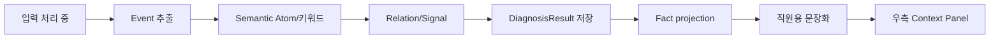

# A파트 Context Pipeline 6.5 평가 보고서

생성 시각: `2026-09-16T13:05:29.592489+00:00`  
목적: 1~6단계 결과의 구조·품질·문장화 연결 상태를 내부적으로 점검

## 한눈에 보는 결과

| 평가 항목 | 결과 |
|---|---:|
| 추출 Event | 5건 |
| Semantic Atom | 9건 |
| Observed Term | 0건 |
| Relation | 2건 |
| Context Signal | 0건 |
| 점검 AI 상태 | `미실행` |
| 점검 AI 점수 | `미실행` |

## 파이프라인 흐름

## 구조 해석

- Event는 통화에서 감지된 사건 단위입니다.
- Semantic Atom은 기관·행동·요구·위협·상태처럼 분리 가능한 의미 단위입니다.
- Observed Term은 실제 표현 중 허용된 짧은 핵심 용어만 보존합니다.
- Relation과 Context Signal은 Atom 간 연결과 복합 위험 신호를 표현합니다.
- 은행 화면에는 개발자용 code가 아니라 Fact 기반 직원용 문장이 표시됩니다.

## 개발자 점검 메모

- `privacy_status`: `PASS`
- 점검 AI 권고: `확인 필요`
- 이 보고서는 운영 웹 UI에 노출하지 않는 내부 평가 자료입니다.
- 원문·긴 문장·민감 숫자 literal은 보고서에 포함하지 않습니다.

## 다음 확인

1. 정답 annotation과 비교해 precision·recall·F1을 산출합니다.
2. Atom→Fact→Statement slot preservation과 unsupported lexicalization을 확인합니다.
3. DB 저장 및 기존 우측 패널 E2E를 별도 실행합니다.