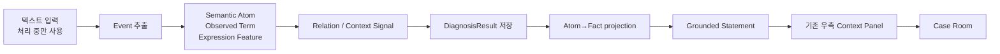

# A파트 Context Pipeline 종합 평가 보고서

상태: `DRAFT — 6.5단계 평가 완료 후 FINAL로 갱신`  
기준일: 2026-09-16  
대상: CSR v3.1 A파트 Context Pipeline

## 1. 보고서 목적

텍스트 입력부터 Case Room 생성과 우측 Context Panel 반영까지 A파트 전체 구조를 한국어로 설명하고,
v3.0 기준선과 v3.1 결과를 비교하기 위한 최종 공유 자료다.

## 2. 한눈에 보는 최종 판정

| 영역 | 결과 | 판정 |
|---|---:|---|
| Event·Semantic Atom 추출 | 미집계 | 정답 annotation 필요 |
| Observed lexical cue 보존 | 미집계 | v3.1 신규 정답 필요 |
| 점검 AI 탐지 | 미집계 | 오탐·미탐 표본 필요 |
| DB 저장 안정성 | 회귀 테스트 통과 | 실제 DB E2E 필요 |
| 문장화 의미 보존 | 미집계 | semantic fidelity 필요 |
| 우측 Context Panel 반영 | 회귀 테스트 통과 | 브라우저 E2E 필요 |
| 개인정보 비보관 | 샘플 PASS | 운영 데이터 scan 필요 |
| A파트 종합 | `DRAFT` | 6.5단계 미완료 |

현재 비교 보고서는 `reports/sample-20260916/baseline/`에 생성되어 있으며,
v3.1 정확도는 annotation과 live run 전까지 `PENDING`으로 유지한다.

## 3. 전체 파이프라인

## 4. v3.0 대비 v3.1 비교

| 지표 | v3.0 Baseline | v3.1 현재 | 해석 |
|---|---:|---:|---|
| LLM Context Feature Recall | 41.45% | 미집계 | 동일 benchmark 재실행 필요 |
| LLM Context Feature Precision | 46.38% | 미집계 | 동일 benchmark 재실행 필요 |
| Critical Fact Recall | 31.37% | 미집계 | Fact projection 비교 필요 |
| Fact Precision | 34.75% | 미집계 | Fact·근거 비교 필요 |
| Semantic Similarity | 46.79% | 미집계 | 보조 지표로만 사용 |
| Contradiction | 7건 | 미집계 | Hard Gate |
| Hallucination | 76건 | 미집계 | Hard Gate |

사용자가 제공한 공식 Gold 3종을 기준으로 평가한다. v3.0 corrected gold는 기존 기준선 비교에,
v3.1 high-fidelity gold는 Atom·Relation·Context Signal 평가에,
canonical human gold는 최종 사람 기준에 사용한다.

## 5. 현재까지 확인된 품질 근거

- General API 저장·패널·평가 도구 회귀 테스트 21건 통과
- AI Atom·lexical·audit·safety 회귀 테스트 52건 통과
- transaction·transition·context display 회귀 테스트 25건 통과
- 6.5 평가기·artifact·v3.0 gold 변환 테스트 5건 통과
- 샘플 developer JSON privacy scan `PASS`
- VP-18 샘플 Event→Atom coverage `1.0`
- VP-18 샘플 Relation lineage rate `1.0`
- VP-18 샘플 Context Signal lineage rate `1.0`

## 6. 최종 취합 지표

| 평가 영역 | 지표 | 결과 |
|---|---|---:|
| 추출 AI | Precision·Recall·F1 | 미집계 |
| 세부 피처 | Critical slot coverage | 미집계 |
| 점검 AI | 오탐·미탐·재추출 회복률 | 미집계 |
| 저장 | transaction·idempotency·revision | 회귀 통과 / 운영 측정 대기 |
| 문장화 | semantic slot preservation·fidelity | 미집계 |
| 패널 | projection coverage·Case Room E2E | 브라우저 검증 대기 |

## 7. 최종 완료 조건

현재 보고서의 `미집계`는 0점이 아니라 아직 측정하지 않았다는 뜻이다.
정답 annotation 없는 AI 정확도 점수, provider가 없는 live 분석 점수, 실제 DB·브라우저 E2E를
임의로 채우지 않는다.

정답 annotation 확정, v3.0 비교 지표 산출, hard gate 확인, DB 저장 검증,
우측 패널 E2E 확인, privacy scan 통과 후 상태를 `FINAL`로 변경한다.
