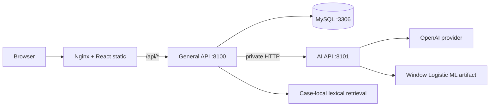
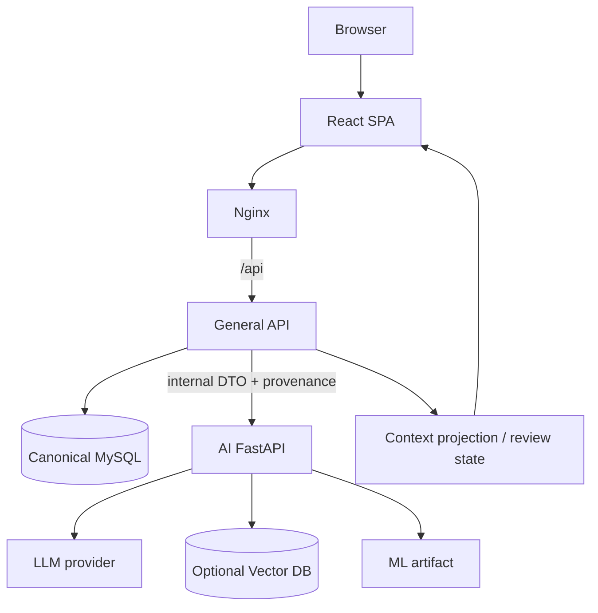
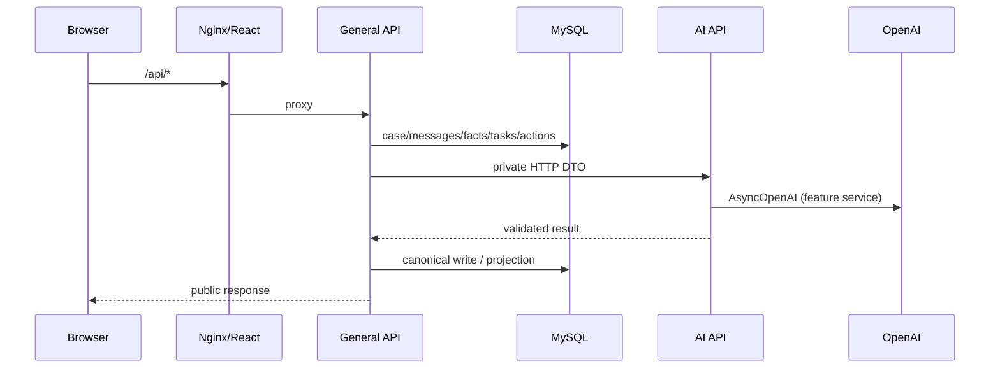

# Backend Architecture Full Audit

감사일: 2026-09-18  
대상: `MVP_v3` 전체 Backend / AI Backend / Frontend / Nginx / Docker / MySQL / LLM / ML / RAG

## 0. 감사 범위와 안전 규칙

이번 작업은 구조 감사만 수행했다. 운영 코드, API 계약, 데이터베이스 스키마, 마이그레이션, Docker 설정을 수정하지 않았고, 브랜치 전환·리셋·스태시·커밋·푸시도 하지 않았다. 보고서 파일만 추가했다.

### 감사 기준점

| 항목 | 값 |
|---|---|
| 브랜치 | `v3.1-ham2` |
| HEAD | `fecc8add833fce6b5c74594fc6f3aa16a4838c11` |
| 작업 트리 | 감사 시작 시 기존 수정 파일과 미추적 문서 폴더가 존재함. 해당 변경은 보존함 |
| 기준 문서 | `MVP_v3/AGENTS.md`, `MVP_v3/docs/CURRENT_STATUS.md`, `MVP_v3/README.md`, `MVP_v3/docker-compose.yml` |

따라서 이 보고서의 “현재”는 깨끗한 main이 아니라 위 커밋과 감사 시점의 작업 트리 기준이다.

## 1. 결론 요약

현재 로컬 Docker 경로의 주 흐름은 다음과 같다.

핵심 경계는 목표 구조와 대체로 일치한다.

- Frontend는 `/api`만 호출하고 AI API나 MySQL을 직접 호출하지 않는다.
- Nginx는 React 정적 파일을 제공하고 `/api/`를 General API로 프록시한다. AI API 포트는 외부 publish가 없다.
- General API가 MySQL의 정식 저장소를 소유하고, AI API는 HTTP 입력을 받아 분석 결과를 반환한다.
- AI API에는 MySQL/SQLite/SQLAlchemy 연결 코드가 확인되지 않았다.
- ML은 AI API 안에서만 실행되며, 승인된 SHA-256과 `scikit-learn==1.6.1`을 검사한다.
- RAG는 벡터 데이터베이스가 아닌 케이스별 메모리 TF-IDF 문자 n-gram 검색이다.

다만 다음은 아직 완결되지 않은 경계 또는 운영 리스크다.

1. 실시간 provider smoke/E2E와 현재 실행 프로세스가 문서상 완전히 검증되지 않았다.
2. LLM 호출이 여러 AI service에 분산되어 있어 중앙 provider gateway/관측 계층이 없다.
3. 실제 vector DB/embedding pipeline은 없다. 현재 구현을 “semantic vector RAG”라고 부르면 안 된다.
4. Docker MySQL init에는 014 마이그레이션만 직접 마운트되며, 018/019 등 후속 마이그레이션은 별도 적용 절차가 필요하다.
5. 인증/RBAC와 `MVP_OPEN_PERMISSIONS` 경계는 MVP 수준으로, 운영 보안 경계로 확정됐다고 보기 어렵다.
6. Nginx에는 WebSocket/SSE 전용 설정이 없다. 현재 요청/응답 HTTP 계약에는 맞지만 streaming 계약은 별도 설계가 필요하다.

판정은 “전면 재설계(D)”가 아니라 **B: 현재 서비스 경계는 유지하되 provider 검증·권한·마이그레이션·관측·RAG를 보강하는 소규모 경계 정리**가 적절하다.

## 2. 목표 아키텍처와 현재 구현 비교

### 목표

### 현재

## 3. Frontend / React 네트워크 감사

| 검사 | 실제 코드 | 판정 |
|---|---|---|
| API 진입점 | `frontend/src/api/client.ts`의 `fetch(apiUrl(path))` | 일치 |
| 기본 URL | `VITE_API_BASE_URL`이 비어 있으면 상대경로 `/api/...` | 일치 |
| 개발 프록시 | `frontend/vite.config.ts`가 `/api`를 `127.0.0.1:8100`으로 전달 | 일치 |
| 운영 프록시 | Nginx `/api/` → `http://general-api:8100` | 일치 |
| 직접 AI 호출 | `8101`, `/ai/*`, `OpenAI` 참조가 frontend에 없음 | 일치 |
| 직접 DB 호출 | MySQL driver/SQL이 frontend에 없음 | 일치 |
| API 도메인 | cases, messages, context-v2, facts, tasks, verifications, actions, reports, attachments, customer endpoints를 General `/api`로 호출 | 일치 |
| WebSocket/SSE | `WebSocket`, `EventSource`와 Nginx upgrade 설정 없음 | 미구현 |

Frontend는 canonical state를 소유하지 않는다. 브라우저 상태는 표시·입력·재조회용이며, 저장은 General API가 담당한다.

## 4. Nginx / 정적 배포 감사

`MVP_v3/frontend/nginx.conf`의 실제 동작은 다음과 같다.

| 기능 | 설정 | 판정 |
|---|---|---|
| 정적 파일 | `/usr/share/nginx/html` | 일치 |
| SPA fallback | `try_files $uri $uri/ /index.html` | 일치 |
| API reverse proxy | `/api/` → `general-api:8100` | 일치 |
| 헤더 전달 | Host, X-Real-IP, X-Forwarded-* | 일치 |
| timeout | read timeout 180초, buffering off | 장시간 AI 응답에 적합 |
| 외부 AI 노출 | AI location/host port 없음 | 일치 |
| upload limit | 11 MB | backend attachment limit과 함께 확인 필요 |
| streaming | WebSocket/SSE 설정 없음 | 현재 계약에는 문제없으나 streaming 시 보강 필요 |

Docker Compose에서 host에 publish되는 것은 frontend의 `${APP_PORT:-80}:80`뿐이다. `general-api:8100`, `ai-api:8101`, `mysql:3306`은 Compose 내부 네트워크 주소다.

## 5. General API 감사

### 책임

General API는 다음 canonical 책임을 가진다.

- 사건/휴지통/복구/삭제와 사건 목록
- 메시지·고객 답변·직원 입력
- MySQL case facts, context-v2 facts/gaps/tasks/suggestions/decisions/history
- 검증·질문·업무 카드·action·report·attachment
- Context Panel projection과 직원 확정/기각 상태
- AI API 호출 결과의 계약 검증 및 canonical 저장

주요 근거 파일은 `backend/general_api/app/main.py`, `domains/cases/context_v3/*`, `case_context_v2_repository.py`, `mysql_repository.py`, `clients/diagnosis_ai.py`다.

### General → AI 계약

`HttpDiagnosisAiClient`는 `AI_API_BASE_URL`(Compose에서는 `http://ai-api:8101`)로 `httpx.AsyncClient` 요청을 보내며 timeout/error/429/401을 분류한다. 맥락 Fact 추출은 provider-backed `model_version`인지 검증하고 deterministic/local/rule/fixture 응답을 canonical panel Fact로 저장하지 않는다.

이 경계는 “AI가 DB를 직접 갱신”하는 구조가 아니라 “General이 AI 결과를 받아 검증 후 저장”하는 구조다.

## 6. AI Backend 감사

`backend/ai_api/app/main.py`에 실제 노출된 대표 라우트는 다음과 같다.

| 라우트 | 역할 | 저장 책임 |
|---|---|---|
| `POST /ai/analyze/text` | 진단/윈도우 분석 | 반환만 |
| `POST /ai/context/facts/extract` | semantic context Fact/관찰 추출 | 반환만 |
| `POST /ai/case-support/snapshot` | 사건 지원 snapshot | 반환만 |
| `POST /ai/case-copilot/replies` | Copilot 답변 | 반환만 |
| `POST /ai/work-cards/generate` | 업무 카드 | 반환만 |
| `POST /ai/final-reports/generate` | 최종 보고서 | 반환만 |
| `POST /ai/analyze/windows` | window 분석 | 반환만 |
| `POST /ai/features/extract` | feature 추출 | 반환만 |
| `POST /ai/risk/predict` | risk 예측 | 반환만 |

### DB 직접 접근

AI API에서 `aiomysql`, `pymysql`, `MYSQL_*`, `sqlite3`, `sqlalchemy`, `create_pool` 검색 결과가 없다. 따라서 현재 코드 기준 AI API는 canonical MySQL을 직접 읽거나 쓰지 않는다. 사건 문맥·메시지·직원 확정 상태는 General이 DTO로 전달한다.

### LLM 호출

`context_fact_extraction_service.py`, `copilot_service.py`, `work_card_service.py`, `brief_service.py`, `final_report_service.py` 등 여러 service가 `AsyncOpenAI`를 직접 생성한다. 모델명·timeout·호출량·출력 토큰은 환경변수로 분리되어 있다.

판정: 호출 위치가 AI API로 격리된 것은 **MATCH**지만, provider client/retry/cost/trace를 한 곳에서 관리하는 중앙 gateway는 **PARTIAL**이다.

## 7. MySQL / 저장 구조 감사

| 영역 | 소유자 | 실제 저장 |
|---|---|---|
| 핵심 사건/메시지 | General API | MySQL `cases`, messages 계열 |
| Context V2 | General API | facts, gaps, suggestions, tasks, decisions, history 계열 |
| 확장 관찰 | General API | context signals/observations 및 projection 계열 |
| 첨부 | General API | `/app/data/uploads` volume + 메타데이터 |
| AI 계산 결과 | AI 계산 후 General 검증 | AI가 직접 canonical write하지 않음 |
| 테스트/개발 대체 저장소 | General 내부 구현 | In-memory 선택지가 있으나 Compose는 `CASE_REPOSITORY=mysql` |

Compose의 MySQL init은 기본 스키마와 `014_case_context_v2_foundation.sql`을 직접 마운트한다. 이후 migration(예: 018/019)은 이미 생성된 volume에 자동으로 순차 적용되지 않으므로 `apply_migrations.py` 등 별도 절차가 필요하다. 이것은 스키마 누락을 일으킬 수 있는 운영 절차상의 **PARTIAL** 항목이다.

MySQL은 `utf8mb4`와 UTC timezone을 사용한다. 애플리케이션의 표시 시간대·입력 시각 변환은 API/프론트 계약에서 별도 확인해야 한다.

## 8. LLM / Provider 감사

현재 Compose는 OpenAI key와 기능별 모델명을 AI API에만 주입한다. General API에는 OpenAI key가 필요하지 않으며 AI API URL만 갖는다.

| 항목 | 판정 |
|---|---|
| provider 호출이 AI API에 격리됨 | MATCH |
| 기능별 모델/토큰/timeout 설정 | MATCH |
| 중앙 provider gateway | PARTIAL (service별 AsyncOpenAI 중복) |
| provider live smoke/E2E | 문서상 미완료/실행 시점 의존, BLOCKED까지 기록 필요 |
| fallback 안전성 | deterministic 응답을 context canonical 저장에서 거부하는 보호장치 있음 |
| 비용·trace 일관성 | 중앙 계층 부재로 보강 필요 |

따라서 프롬프트를 더 늘리는 것보다, provider 응답의 provenance/model version/검증/재시도/비용 trace를 공통 계층으로 묶는 것이 우선이다.

## 9. ML 감사

AI API에 `WINDOW_LOGISTIC_DASHBOARD_EXPERIMENTAL_SAMPLE_v1.pkl`이 있고 `diagnosis/model_adapter.py`가 다음을 검사한다.

- `scikit-learn==1.6.1` 정확 일치
- 파일 존재 여부와 승인된 SHA-256
- model bundle 필수 key
- runtime `WINDOW_RISK_THRESHOLD` 범위
- signal이 없을 때 guardrail cap 적용

`diagnosis/window_ai/service.py`의 흐름은 `원문 → 문장별 Event → Feature Builder → Window Logistic`이다. 모델 artifact는 AI API 내부에서만 로드되며 Frontend/General이 직접 실행하지 않는다.

판정: 실행 위치와 artifact 검증은 **MATCH**. 파일명과 bundle 상태가 experimental sample이므로 운영 승인 모델/모니터링/재학습 pipeline은 별도 **PARTIAL**이다.

## 10. RAG / 검색 감사

`backend/general_api/app/domains/cases/case_retrieval.py`는 스스로 “Case-local lexical RAG”라고 명시한다.

- Korean spacing 차이를 위한 정규화
- character 2/3-gram TF-IDF
- 소규모 synonym map
- case/audience/content fingerprint 기반 메모리 cache
- 권한이 있는 같은 사건 records만 index

원격 embedding 호출, vector DB, 영속 vector index, 별도 retrieval service는 확인되지 않았다. 따라서 현재 RAG 판정은 **LEXICAL_RETRIEVAL_ONLY / VECTOR_DB_NOT_PRESENT**다. “RAG가 있다”는 표현은 lexical retrieval 범위로 한정해야 한다.

## 11. Docker / 네트워크 감사

| 서비스 | 이미지/실행 | 내부 포트 | 외부 노출 | 의존성 |
|---|---|---:|---|---|
| `mysql` | `mysql:8.4` | 3306 | 없음 | healthcheck |
| `ai-api` | `Dockerfile.ai-api`, uvicorn | 8101 | 없음 | general이 healthy 의존 |
| `general-api` | `Dockerfile.general-api`, uvicorn | 8100 | 없음 | mysql healthy + ai healthy |
| `frontend` | React build + `nginx:1.27-alpine` | 80 | `${APP_PORT:-80}:80` | general healthy |

Compose의 AI/general 모두 `expose`가 아니라 컨테이너 간 DNS로 접근하며, public edge는 Nginx다. 개발 모드에서는 React Vite가 5176에서 `/api`를 localhost:8100으로 프록시하므로 Docker 운영 경로와 호스트 포트가 다르다.

## 12. 목표 대비 판정표

| 질문 | 판정 | 근거 |
|---|---|---|
| 1. React/Nginx/General/AI/MySQL 경계가 있는가? | YES (vector DB 제외) | Compose와 실제 라우트 |
| 2. Frontend가 AI를 직접 호출하지 않는가? | YES | `src/api/*`가 `/api`만 호출 |
| 3. Frontend가 MySQL을 직접 호출하지 않는가? | YES | DB driver/SQL 없음 |
| 4. General API가 canonical MySQL owner인가? | YES | repository + `CASE_REPOSITORY=mysql` |
| 5. AI API가 canonical DB를 직접 mutate하지 않는가? | YES | AI DB import 없음, General client 경유 |
| 6. General↔AI HTTP 계약이 실제 연결되는가? | YES | `HttpDiagnosisAiClient`, Compose DNS |
| 7. LLM 호출이 AI API에 격리되는가? | YES/PARTIAL | OpenAI import는 AI 쪽이나 중앙 client는 없음 |
| 8. ML이 AI API 내부에서 실행되는가? | YES | WindowAiAdapter/model_adapter |
| 9. 실제 vector DB 기반 RAG가 있는가? | NO | TF-IDF 메모리 lexical retrieval |
| 10. Nginx가 production gateway인가? | YES | `/api` proxy, AI public port 없음 |

보조 판정: 인증/RBAC는 **PARTIAL**, SSE/WebSocket은 **MISSING**, 후속 migration 자동 적용은 **PARTIAL**, provider live readiness는 **UNKNOWN/BLOCKED until smoke test**다.

## 13. 확인된 리스크와 개선 우선순위

### P0: 운영 전 확인

1. 실제 배포 환경에서 General→AI provider smoke와 대표 E2E를 실행하고 request ID, model version, 오류 코드를 기록한다.
2. 초기 schema와 후속 migrations의 적용 순서를 단일 배포 절차로 명시한다. 이미 있는 volume에 init SQL만 기대하지 않는다.
3. `MVP_OPEN_PERMISSIONS`와 직원/customer 권한을 운영 경계로 재검토한다.
4. summary/panel projection에서 `CONFIRMED`, `REJECTED`, `PENDING`, `UNMAPPED` 상태를 분리하고 최신 projection만 계산한다.

### P1: 구조 보강

1. AI provider 공통 client/gateway를 두어 timeout, retry, quota, cost, model provenance, trace를 통합한다.
2. HTTP polling으로 충분하지 않은 기능만 SSE/WebSocket 계약을 별도 추가하고 Nginx upgrade/timeout을 함께 정의한다.
3. lexical retrieval을 유지하되, embedding/vector DB가 실제 요구될 때만 별도 저장소·보존정책·권한 필터를 설계한다.
4. ML artifact registry, 승인 상태, drift/threshold 모니터링을 운영 계약으로 승격한다.

### P2: 선택 사항

외부 기관 검증/RAG, 대용량 object storage, 중앙 observability/trace backend, 비동기 job queue는 사용량과 규제 요구가 확정된 뒤 도입한다.

## 14. 변경이 필요한가?

현재 서비스 경계를 폐기하고 재설계할 필요는 없다. 다음 세 가지는 경계를 유지한 채 보강한다.

- **유지:** Browser → Nginx → General → MySQL/AI, AI 내부 LLM/ML 격리
- **보강:** provider gateway, 인증/RBAC, migration runner, readiness/E2E, provenance-aware projection
- **조건부 도입:** vector DB, streaming, queue, object storage

## 15. 감사 산출물과 근거 파일

- `MVP_v3/docker-compose.yml`
- `MVP_v3/frontend/nginx.conf`
- `MVP_v3/frontend/Dockerfile`, `vite.config.ts`, `src/api/client.ts`, `src/api/cases.ts`
- `MVP_v3/backend/general_api/app/main.py`
- `MVP_v3/backend/general_api/app/clients/diagnosis_ai.py`
- `MVP_v3/backend/general_api/app/domains/cases/context_v3/*`
- `MVP_v3/backend/general_api/app/domains/cases/case_retrieval.py`
- `MVP_v3/backend/ai_api/app/main.py`
- `MVP_v3/backend/ai_api/app/domains/case_support/*`
- `MVP_v3/backend/ai_api/app/domains/diagnosis/model_adapter.py`
- `MVP_v3/backend/ai_api/app/domains/diagnosis/window_ai/service.py`
- `MVP_v3/database/01_mysql_csr_schema.sql`
- `MVP_v3/backend/migrations/*`
- `MVP_v3/README.md`, `MVP_v3/docs/CURRENT_STATUS.md`, `MVP_v3/AGENTS.md`

## 최종 판정

현재 구조는 **General API가 canonical state와 DB를 소유하고 AI API가 분석을 반환하는 분리형 구조**로, Frontend 직접 DB/AI 호출 금지와 Nginx AI 비노출 목표를 충족한다. 다만 vector DB는 존재하지 않고 lexical retrieval만 있으며, provider 운영 검증·권한·후속 migration·중앙 LLM client는 미완성이다. 따라서 현 단계의 권고는 **B(경계 유지 + 운영/계약 보강)**이다.
