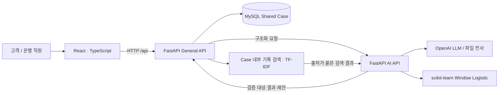

# CSR | Case Share Room — 전체 기술 스택

> 작성일: 2026-10-03  
> 기준: 팀 협업·구현 총정리 첨부 자료(2026-10-02 작성), 현재 저장소 코드, 의존성·배포 설정·테스트 및 검증 기록  
> 코드 기준: 로컬 HEAD `2bee7f6e`. 현재 실행 구현은 `MVP_v3`를 중심으로 확인했다. 버전 표기는 설치된 버전을 추정하지 않고 의존성 선언 또는 컨테이너 태그를 사용했다.

CSR은 통화 분석 결과와 고객·직원의 진술, 확인 결과, 대응 업무를 Shared Case에 모으는 보이스피싱 대응 워크스페이스다. 아래 기술 목록은 **서비스 코드에서 사용하는 기술**, **별도 실험·개발·협업 도구**, **후속 연동 구성**을 표시한다. 코드 존재와 실제 운영 검증 완료는 구분한다.

## 1. 전체 구성

| 계층 | 역할 | 대표 코드 |
|---|---|---|
| Frontend | 사건 목록·고객 상담·은행 Case Room·담당자 배정·업무 UI | [frontend/src](MVP_v3/frontend/src) |
| General API | Case 생성·공개 범위·상태 전이·영속 저장·AI 요청 조립 | [general_api/app/main.py](MVP_v3/backend/general_api/app/main.py) |
| AI API | 이벤트 추출·맥락 재구성·ML 추론·상담·업무 카드·최종 보고서 | [ai_api/app/main.py](MVP_v3/backend/ai_api/app/main.py) |
| 데이터 계약 | 요청·응답·근거·버전·공개 범위의 공통 스키마 | [backend/contracts](MVP_v3/backend/contracts) |
| DB | 사건·Fact·대화·질문·Verification·Task·Action·이력의 원장 | [DB_CATALOG.md](MVP_v3/database/DB_CATALOG.md) |
| 실행·배포 | Nginx 프록시, API 컨테이너, MySQL, healthcheck | [docker-compose.yml](MVP_v3/docker-compose.yml) |

## 2. 서비스 기술 목록과 적용 위치

### 2.1 언어·Frontend

| 기술 | 선언 버전·방식 | 사용 위치 | 구현 내용 |
|---|---|---|---|
| TypeScript | `^5.3.3` | Frontend 전체, `src/api/types.ts` | API 응답 타입, Case·질문·배정·Context 상태의 타입 검사 |
| React / React DOM | `^18.2.0` | `App.tsx`, `pages`, `components`, `customer`, `context-v3` | 고객·은행 화면 분리, Hook 기반 조회·입력·모달·상태 관리 |
| React Router DOM | `^6.20.0` | `App.tsx`, 페이지 이동 | Case URL과 고객·은행 화면 전환 |
| Vite / React 플러그인 | `^5.0.8` / `^4.2.1` | `frontend`, 개발 프록시·빌드 | 로컬 개발 서버와 production 정적 파일 생성 |
| HTML / CSS | 웹 표준, `styles.css` | 사건 보드·채팅·우측 패널 | 영역별 레이아웃, 상태 badge, 카드·모달·반응형 화면 |
| Lucide React | `^0.307.0` | UI 컴포넌트 | 업무 기능·상태·메뉴 아이콘 |
| Fetch / AbortController / ReadableStream | 브라우저 API | `src/api/client.ts`, `audioTranscription.ts` | HTTP 요청·시간 초과·오류 처리, 음성 전사 스트림 읽기 |
| localStorage 등 브라우저 저장소 | 브라우저 API | `draftStorage.ts`, `assignmentPromptState.ts`, bookmarks 관련 코드 | 같은 브라우저에서 초안·초기 질문·보류 상태·북마크 복원; 서버 원장과 별개 |
| polling / heartbeat | Case 조회 5초, presence 30초 | `pages/CaseRoomPage.tsx` | 사건 상태 갱신과 접속 상태 표시; Case 동기화는 주기적 HTTP 조회 |
| 백그라운드 분석 추적 | Promise·request ID·4초 상태 조회 | `analysisQueue.ts` | SPA 화면 이동 중 진행 요청 유지, 잠정 Case와 전체 분석 완료·실패 알림 |

근거: [package.json](MVP_v3/frontend/package.json), [CaseRoomPage.tsx](MVP_v3/frontend/src/pages/CaseRoomPage.tsx), [analysisQueue.ts](MVP_v3/frontend/src/analysisQueue.ts).

### 2.2 Backend·API·데이터 계약

| 기술 | 선언 버전·방식 | 사용 위치 | 구현 내용 |
|---|---|---|---|
| Python | Docker Python 3.11, CI Python 3.12 | General API·AI API·유틸리티 | 비동기 API, 업무 규칙, 데이터 구조화·모델 실행·검증 자동화 |
| FastAPI | `>=0.115,<1.0` | 두 API의 `app/main.py` | 공개 `/api/*`와 내부 `/ai/*` 분리, 요청·응답 계약, HTTP 오류, OpenAPI |
| Uvicorn | `standard`, `>=0.30,<1.0` | API 실행·Docker CMD | ASGI 서버, General API 8100 / AI API 8101 |
| Pydantic v2 | `>=2.10,<3.0` | `contracts/diagnosis.py`, `ai_internal`, `public_api` | 필수값·Literal/Enum·금액 범위·문자열 길이·버전 검증, `extra=forbid`, 사용자 정의 validator |
| JSON / JSON Schema | Pydantic 생성 및 명시적 schema | LLM 구조화 응답, DB JSON 컬럼 | `model_json_schema()`로 형식 제시, `model_validate_json()`·`model_validate()`로 결과 검사 |
| HTTPX | `>=0.27,<1.0` | General→AI 클라이언트, 음성 전사 프록시 | 비동기 HTTP, 연결·응답 시간 제한, provider 오류·스트림 전달 |
| asyncio | Python 표준 라이브러리 | 분석 작업·Copilot 작업·고객 AI 예산 | 비동기 실행, Lock·Semaphore, 동시 요청 제한과 작업 직렬화 |
| python-dotenv | `>=1.0,<2.0` | 두 API·migration 도구 | `MVP_v3/.env` 환경설정 로딩; 키·비밀번호를 문서에 포함하지 않음 |
| hashlib / UUID / context manager | Python 표준 라이브러리 | 모델·입력 지문, 작업 ID, request trace | SHA-256 무결성 검사, 요청 추적·중복 방지·근거 식별 |
| 정규식·Unicode 정규화 | `re`, `unicodedata` | 피처·채팅 Fact 추출·grounding | 한국어 금액 단위, 부정·불확실·정정 구분, 표기 정규화 |

Pydantic은 데이터의 구조와 제약을 검사한다. 의미 누락·환각의 최종 검증은 별도의 품질 검정과 정답셋 평가가 담당한다.

### 2.3 AI·ML·검색·음성

| 기술 | 선언 버전·방식 | 사용 위치 | 구현 내용 |
|---|---|---|---|
| OpenAI Python SDK | `>=1.68,<3.0`, `AsyncOpenAI` | AI API의 LLM 서비스 | Responses API 기반 이벤트·맥락·상담·업무·보고서 생성 |
| OpenAI Responses API | 기능별 prompt·model 환경변수 | `extractor.py`, `context_features.py`, `copilot_service.py` 등 | 동일 provider 안에서 역할별 입력·출력·공개 범위 분리; 모델별 설정은 아래 표 참조 |
| Structured Outputs | `json_schema`, 지원 호출의 `strict=True` | 이벤트·Context·quality review·은행 Copilot·업무 카드·보고서 | 비정형 출력 대신 명시적 구조화 응답을 요청하고 서버에서 재검증 |
| scikit-learn | **`1.6.1` 고정** | `diagnosis/model_adapter.py`, 모델 artifact | Window Logistic Pipeline의 `predict_proba`; 학습 재현보다 artifact 로딩·계약 검증·서비스 추론이 현재 확인 범위 |
| pandas | `>=2.2,<4.0` | `model_adapter.py` | 모델 입력의 컬럼 이름·순서를 DataFrame으로 고정 |
| NumPy | `>=1.26,<3.0` | `diagnosis/features.py` | 금액 변환·수치 집계·파생 피처 계산 |
| joblib / pickle artifact | `joblib>=1.3,<2.0` | `ai_api/models`, `model_adapter.py` | 해시를 확인한 승인 모델 bundle 로딩, 메모리 캐시 |
| Semantic Atom·Relation·Context Signal | 프로젝트 자체 스키마·Python 규칙 | `semantic_atoms.py`, `relations.py`, `grouping.py` | 발화자·행동 주체·대상·요구/실행·금액·근거를 분리하고 관계·episode·entity registry 구성 |
| TF-IDF / 문자 n-gram / cosine similarity | Python 표준 라이브러리로 직접 구현 | `general_api/.../case_retrieval.py` | Case·audience별 허용 기록만 검색, 2·3글자 n-gram, 최대 6개 출처 반환, 내용 지문 기반 캐시 |
| 공식 자료 검색 실험 | 2·3·4글자 n-gram TF-IDF | `ai_system_design/rag/retrieval/simple_retriever.py` | JSON chunk corpus 검색과 출처 반환; 별도 설계·테스트 코드이며 현행 Case Room 외부 지식 자동 연동의 증거와 구분 |
| OpenAI Audio Transcriptions API | 기본 설정 `gpt-4o-transcribe` | AI `/ai/audio/transcriptions/stream` | 업로드 음성 파일의 한국어 전사, 부분 결과 SSE 전달, 형식·용량·provider 오류 검사 |
| SSE / StreamingResponse | `text/event-stream` | 음성 전사 프록시·Frontend parser | 업로드 파일의 전사 결과를 점진적으로 표시. Case 변경 이벤트 동기화나 실시간 통화 STT와는 별도 경로 |

### 2.4 DB·문서 출력·실행·품질관리

| 기술 | 선언 버전·방식 | 사용 위치 | 구현 내용 |
|---|---|---|---|
| MySQL / InnoDB | Compose `mysql:8.4`, CI `mysql:8.0` | Shared Case DB | 관계형 원장, JSON payload, FK·인덱스·unique·transaction·trigger |
| aiomysql | `>=0.2,<1.0` | General API repositories | 비동기 connection pool, 업무 저장·조회, transaction·row lock |
| PyMySQL | `>=1.1,<2.0` | DB 검사·migration·catalog 스크립트 | 동기 schema 관리·백업/검사 도구 |
| SQL migration / manifest | 프로젝트 자체 구현 | `backend/migrations`, `backend/scripts` | 순서 기반 증분 적용, bootstrap 생성, schema 비교, 백업·복원 리허설 도구 |
| python-docx | `>=1.1,<2.0` | General API 최종 보고서 export | 저장된 FINAL 보고서를 제목·섹션·문단으로 DOCX 출력 |
| ReportLab | `>=4.2,<5.0` | 같은 export endpoint | 한국어 CID font·페이지 나눔을 적용해 PDF 출력 |
| Docker / Docker Compose | API·Frontend Dockerfile, 4 services | `MVP_v3/docker-compose.yml` | Frontend·General API·AI API·MySQL 컨테이너, healthcheck·서비스 의존성·DB volume |
| Node.js / npm | Docker·CI Node 20 | Frontend 개발·빌드 | `npm ci`, package-lock 기반 의존성 설치·타입검사·테스트·빌드 |
| Nginx | `nginx:1.27-alpine` | Frontend image, `nginx.conf` | SPA 정적 파일·history fallback·`/api` reverse proxy, 전사 스트림 buffering 해제 |
| pytest / pytest-subtests / unittest | CI 설치·Python 테스트 | 두 API의 `tests` | 계약·질문·Fact·Case·Copilot·migration·격리 MySQL 회귀 |
| Vitest | `^1.6.1` | Frontend `*.test.ts` | API 오류·초안·분석 알림·고객 action 등 로직 검증 |
| TypeScript 검사 | `tsc -b` | `npm run typecheck`, `lint`, `build` | 타입·빌드 오류 검증. 현재 `lint` script는 ESLint가 아닌 TypeScript 검사 |
| GitHub Actions | `analysis-envelope-guard.yml` | 저장소 CI | Envelope/Case 회귀·MySQL schema·Frontend 테스트/빌드·diff 검사. 설정 존재를 모든 실행 성공으로 해석하지 않음 |
| JSON / CSV / Markdown 평가 artifact | 자체 replay·evaluator scripts | `replay_benchmark`, A파트 평가 자료 | case별 출력·지연·token·정답 투영·실패 상태·보고서 보존 |
| 정적 구현 탐색기 | Python·Node scanner, JSON metadata | `tools/judge_explorer`, `frontend/public/judge` | API·DB·Frontend·AI·배포 근거를 정적 소개 페이지로 생성 |

## 3. AI·LLM 구성요소는 몇 개이며 어디에 연결했는가

### 3.1 개수 산정 기준

- 명시적으로 `Agent` 이름을 가진 역할 클래스는 **3개**다. `AgentRouter` 1개가 네 가지 task key를 세 클래스에 연결한다.
- 세 클래스는 `MvpWorkflowService`의 **규칙 기반 업무를 감싸는 facade**다. 각각 독립적인 LLM을 탑재한 자율 에이전트로 세지 않는다. 현재 HTTP snapshot 경로는 `CaseSnapshotAiAdapter → MvpWorkflowService`를 직접 사용한다.
- 서비스 LLM은 **8개 기능 묶음 / 9개 역할**로 아래에 정리했다. 품질 검정을 추출 검정·문장 검정 두 역할로 나누면 9개다. 이 수는 모델 파일 수·학습 모델 수·Case당 고정 호출 횟수가 아니다.
- 음성 전사 provider 경로 1개, Window Logistic ML adapter 1개, 규칙 기반 Fact·질문·업무 조립 계층은 별도로 관리한다.

### 3.2 실제 서비스 LLM의 9개 역할

| 번호 | 역할·실제 코드 | 입력 → 출력 | 붙인 위치 / 실행 조건 | 모델 설정 |
|---:|---|---|---|---|
| 1 | 발화별 Event·Atom 추출 / `extractor.extract_events()` | 통화 발화 → 5개 event family, 의미 단위·주체·근거 | 데모 텍스트 분석의 `WindowAiAdapter`; 발화 수와 재시도에 따라 여러 호출 | `OPENAI_EVENT_MODEL` |
| 2 | 독립 Context Feature 추출 / `extract_case_context_features()` | 통화 발화 → 사칭·주장·요구·수법·실제 행동 코드와 turn/status | `DiagnosisService._build_demo_envelope()`; Event-only 투영과 별도로 추출 | `OPENAI_CONTEXT_MODEL` |
| 3 | 전체 사건 맥락 재구성 / `FullContextDiagnosisHandler` | 구조화 signal payload → 사건 요약·주장·요구·수법·문장 근거 | Envelope 분석 후 은행 사건 맥락 생성 | `OPENAI_CONTEXT_MODEL` |
| 4 | 추출 품질 검정 / `review_extraction()` | Envelope·결정론적 audit → ACCEPT/REEXTRACT/HUMAN_REVIEW | `DiagnosisService`; 기능 설정·예산·루프 상한 내 실행 | `OPENAI_AUDIT_MODEL`, 미설정 시 Context 모델 |
| 5 | 재구성 문장 품질 검정 / `review_narrative()` | Envelope·Context 문장 → ACCEPT/RERENDER/HUMAN_REVIEW | 사건 맥락 생성 후, 제한적 재생성 | 같은 Audit 설정 |
| 6 | 은행 직원용 CaseCopilot / `CaseCopilotService` | 최신 내부 Fact·질문·검증·업무·채팅·검색 출처 → 답변·허용 action·task intent | 은행 내부 채팅, 최초 브리핑, 사건 상태 변경 안내 | `OPENAI_BANK_COPILOT_MODEL`, 공통 Copilot fallback |
| 7 | 고객용 안전 상담 / `CustomerSupportService` | 고객 공개 질문·진행·답변·확인 결과 → 쉬운 안전 안내 | 같은 Copilot API의 `CUSTOMER_SUPPORT` 분기, 고객 채팅 | `OPENAI_CUSTOMER_SUPPORT_MODEL`, 공통 Copilot fallback |
| 8 | 업무 카드 초안 / `CaseWorkCardService` | Case 업무 맥락 → 확인 질문·기관 확인·대응 단계 초안 | `/ai/work-cards/generate` → General API → 업무 작성 화면 | `OPENAI_CASE_WORK_CARD_MODEL` |
| 9 | 최종 사건 보고서 / `FinalCaseReportService` | 최신 사건 기록·종결 메모 → 12개 보고서 항목 | `/ai/final-reports/generate` → 저장된 FINAL 보고서·export | `OPENAI_FINAL_REPORT_MODEL`, 업무 카드 모델 fallback |

모델명은 환경변수로 교체할 수 있다. 현재 코드·`.env.example`의 다수 LLM 예시는 `gpt-5.6-luna`이며, Docker Compose의 여러 fallback은 `gpt-4o-mini`다. 이 문서는 실제 실행 프로세스에 주입된 모델이나 API 계정의 가용성을 검증하지 않았으므로 특정 모델이 모든 기능에서 실제 호출됐다고 단정하지 않는다.

추가 보조 코드로 `review_semantic_audit()`와 `CaseBriefService.build()`의 LLM 보강 경로가 있다. 원문을 사용하는 audit helper와 구조화 Envelope만 검정하는 reviewer는 입력 경계가 다르다. 현재 표의 9개 역할은 주 서비스 연결을 기준으로 했으며, 보조 함수·재시도를 새 에이전트로 중복 집계하지 않았다.

### 3.3 이름이 Agent인 세 클래스

| 클래스 | 맡는 task | 연결·구현 방식 |
|---|---|---|
| `CaseSupportAgent` | `BUILD_BRIEF` | 기존 진단으로 CaseBrief 구성; 규칙 기반 workflow 위임 |
| `CustomerVerificationAgent` | `RECOMMEND_QUESTIONS`, `STRUCTURE_CUSTOMER_ANSWER` | 미확인 사항 질문 추천, 명확한 긍정/부정 답변 구조화 |
| `CaseUpdateAgent` | `UPDATE_BRIEF` | 구조화 답변을 brief에 반영하고 미확인 항목 갱신 |
| `AgentRouter` | task→담당 클래스 선택 | 자체 routing map. 현재 API 진입점에서 이 router를 호출하는 사용처는 확인되지 않으며 클래스·테스트 구현으로 분류 |

근거: [agents.py](MVP_v3/backend/ai_api/app/domains/case_support/agents.py), [agent_router.py](MVP_v3/backend/ai_api/app/domains/case_support/agent_router.py), [workflow.py](MVP_v3/backend/ai_api/app/domains/case_support/workflow.py), [case_snapshot_adapter.py](MVP_v3/backend/ai_api/app/domains/case_support/case_snapshot_adapter.py).

### 3.4 규칙 기반 계층과 LLM의 협업

| 계층 | 실제 구현 |
|---|---|
| 채팅→Fact | `ContextFactExtractionService`: 정규식·한국어 표현으로 송금·노출·앱 설치·부정·정정·직원 확인 보고 추출. 현재 이 서비스 자체에는 provider 호출이 없음 |
| 미분류 관찰 | `OTHER`와 `UnmappedObservation`/`ContextUnmappedObservation`; 허용된 미분류 용어·근거·후보 분류·UNMAPPED 상태 보존. 모든 누락 의미가 자동 복원되는 보장은 없음 |
| 질문 정책 | `QuestionIntelligenceService`, `QuestionStateEvaluator`, question policy: 이미 확인되었거나 답변 대기 중인 동일 항목 제외 |
| ML 입력 생성 | `features_from_events()`가 존재·반복·다양성·금액·결합 신호 계산 |
| 위험 결과 병합 | `DiagnosisFusion`: 대표 위험 Window와 Context·근거·모델 메타데이터 결합 |
| Copilot 안전 검사 | `CopilotQualityEvaluator`, grounding·허용 action 검사·재생성/대체 안내; 고객 개인정보 요구·없는 UI·외부 완료 주장 검사 |
| Task 적용 | General API가 intent의 대상 ID·버전·직원 메시지·권한을 검사하고 저장. AI API는 DB를 직접 수정하지 않음 |

### 3.5 모델 실행 계약

| 항목 | 확인 범위 |
|---|---|
| artifact | `WINDOW_LOGISTIC_DASHBOARD_EXPERIMENTAL_SAMPLE_v1.pkl` |
| 모델 | scikit-learn Logistic Pipeline, `EXPERIMENTAL_SAMPLE` |
| 입력 | artifact `model_features` 23개, 최근 발화 Window 기본 길이 10 |
| 원본 임계값 | artifact `0.95`; `WINDOW_RISK_THRESHOLD` runtime override 지원. `.env.example`에는 `0.60` 예시가 있으므로 실제 적용값은 실행 환경에서 확인 |
| 출력 | raw score·최종 score·threshold·NORMAL/PHISHING·guardrail flags·버전·해시 |
| 보호 규칙 | 무신호 점수 cap, 금전 단독 신호 판정 제한 |
| 로딩 검사 | scikit-learn 1.6.1, SHA-256, 필수 bundle key 확인 |
| 해시 | `662db2a9351dc4ca2c453776ae6f45750e465234cc9abcecc65b58a6b047c5fc` |
| 재현 경계 | 서비스 추론·artifact 계약은 확인. 전체 학습 원본·통화 단위 train/test split·재학습 성능은 별도 증빙 필요 |

## 4. 기술을 사용해 구현한 업무 기능

| 기능 | Frontend / Backend / DB 연결 | 상세 구현·현재 경계 |
|---|---|---|
| 통화 분석·Case 생성 | Home 분석 입력 → General API → AI 진단 → `cases`, `analysis_segments`, `context_features` | NORMAL/PHISHING과 생성 disposition 구분, request ID·상태·오류 관리, 일부 분석 후 전체 결과 백그라운드 반영 경로 |
| 사건 통합 게시판 | `CaseListPane` → Case API | 사건 ID·요약·상태·최근 수정·새 Case 표시, 검색·필터·정렬·상세 접근 |
| 직원 디렉터리 | `BankStaffManager` → staff API → `bank_staff_directory` | 이름·업무 역할·직위·근무 상태·배정 가능 여부 등록/수정/삭제·검색. 독립적인 부서·전문분야·업무량 필드는 현재 계약에서 확인되지 않음 |
| 최초·수정 배정 | `CaseAssignmentDialog` → members API → `case_members` | 역할 키워드·상태·직위·배정 가능 여부로 후보 추천; 동률에는 random tie-break. 사건 위험도·사기 유형·업무량 입력을 사용하는 LLM 추천은 현재 구현하지 않음 |
| 고객·은행 채팅 | 고객 room / 은행 room → messages API | 고객 공개·은행 내부 채널 분리, 사람 메시지의 출처 보존, AI 생성문을 새 사실 근거로 재사용하지 않음 |
| Context V3 패널 | case-support projection → `right_panel` → `ContextPanelV3` | 현재 요약 + 피해·노출 / 확인·조치 진행 / 주요 사기 정황 / 처리 기록의 4개 영역; 요청·실행·부인·확인 출처 구분 |
| 고객 확인 질문 | snapshot·질문 정책 → 선택지/자유답변 카드 → `customer_questions` | 후보·직원 검토·발송·답변 접수 분리, 질문 중복 억제·보류 복원·버전 검사 |
| 기관 확인·대응 업무 | action dialog → verification/task/action API | 확인 요청·결과·공개 여부·업무 상태 저장. 실제 기관 조회·지급정지 API 자동 실행은 후속 연동 |
| CaseCopilot 연결 | 내부 채팅·job → snapshot/RAG → LLM → 허용 action | CUSTOMER_QUESTION, TRANSACTION_LOOKUP, OFFICIAL_VERIFICATION, RESPONSE_ACTION, NONE 계약. 현행 추천에서 mock 거래조회 버튼을 제외하는 정책 적용 |
| 작업 중복·충돌 방지 | `case_copilot_jobs`, projection repository | Case별 lock·lease·dedupe key·revision, 성공 결과 cache와 생성중/실패 상태; Celery/Redis를 사용한 구성은 확인되지 않음 |
| 종결·복구·보고서 | Admin dialog → lifecycle/final report/export API | 관리자 검사, 종결 메모, 보고서 저장·공개 범위·PDF/DOCX 출력 |

## 5. 팀 협업·개발·실험에 사용한 도구

| 도구·기술 | 용도 | 증빙·상태 |
|---|---|---|
| Git / GitHub | 브랜치·Commit·PR·병합·충돌 조정·코드 리뷰 | 저장소 이력과 첨부 협업 기록 |
| GitHub Actions | 자동 계약·schema·Frontend 검사 | 현행 workflow 파일 |
| Notion | 회의록·자료실·체크리스트·역할·일정·PPT 자료 | 첨부 기록 근거; 이번 문서 작성에서 원격 페이지를 새로 조회하지 않음 |
| 카카오톡 | 구두 회의 대체·긴급 수정·진행 공유 | 첨부 기록의 대화 export 참조 |
| Codex | 구현·리팩터링·문서·계약 검사·테스트·병합 보조 | 첨부 기록과 저장소 개발 문서 |
| Google Drive / 공유 폴더 | 데이터·ERD·PPT·PDF 전달 | 첨부 협업 기록 |
| PowerShell / Python / Node CLI | 로컬 실행·스크립트·회귀·빌드 | README·CI·도구 스크립트 |
| CSV / SILVER 라벨링 | 통화 자료 정제·자동 추출·LLM 후보 라벨 | 첨부에는 발췌 통화 776건 기록. 전량 검수된 Gold로 해석하지 않음 |
| faster-whisper / pyannote | 개인 음성 전사·화자 분리 실험 | 첨부에 수행 이력 기재. 현행 서비스 의존성·연동 코드에는 확인되지 않아 개인 실험으로 표시 |
| 영상·음원 다운로드 RPA | 개인 수행 기록의 513건 다운로드 | 실행 도구·스크립트·로그 미확인. Selenium/Playwright/UiPath 등의 특정 제품을 사용 기술로 확정하지 않음 |

## 6. 배포 구성·후속 개발 범위

Docker·Nginx·Compose 실행 구성은 저장소에 구현되어 있다. AWS RDS 접속과 Secrets Manager/배포 환경변수 주입은 README에서 안내하지만, 이번 정리에서는 실제 AWS 리소스·배포 성공 로그를 확인하지 않았다. 따라서 AWS를 운영 완료 실적으로 집계하지 않는다. 추가로 Dockerfile의 COPY 대상에 현재 `audio_upload.py`가 포함되지 않아 음성 경로까지 컨테이너에서 정상 동작하는지는 별도 수정·실행 확인이 필요하다.

| 범위 | 현재 상태 |
|---|---|
| 업로드 음성 전사 | Frontend·General API·AI API 연결 코드 존재. 실제 provider·브라우저 전사 품질은 이번에 재시험하지 않음 |
| Case 동기화 | HTTP polling 구현; Case SSE/WebSocket은 후속 과제 |
| 실시간 음성 통화·Streaming STT | 업로드 파일 SSE와 별개; 통신사·전화 세션 연동은 후속 과제 |
| RAG | Case 내부 lexical RAG 연결; Vector DB·원격 embedding 기반 RAG는 미사용 |
| 운영 인증·RBAC | MVP actor·역할·공개 범위 검사 존재; 운영 로그인·세션·SSO는 후속 과제 |
| 외부 금융 업무 | 기관 확인·거래·Action 기록 UI 존재; 실제 FDS/ASAP·은행 거래·지급정지 API는 미연동 |
| 채팅 첨부파일 | 현행 attachment API는 410으로 retired. 음성 분석 업로드와 구분 |
| LLM framework | 현재 확인된 구현은 SDK·자체 Python orchestration. LangChain/LangGraph/Agents SDK 사용은 확인되지 않음 |
| n8n / Airbyte | 기존 팩트체크상 알림 계획 또는 미사용 기록; 현재 서비스 스택에 포함하지 않음 |

## 7. 확인한 근거

- [전체 포트폴리오](전체%20포트폴리오.md): 기능·역할·수행 과정·검증 해석.
- [서비스 README](MVP_v3/README.md), [현재 상태 기록](MVP_v3/docs/CURRENT_STATUS.md).
- [Frontend 의존성](MVP_v3/frontend/package.json), [Backend 의존성](MVP_v3/backend/requirements.txt), [환경설정 예제](MVP_v3/.env.example).
- [AI API 진입점](MVP_v3/backend/ai_api/app/main.py), [General API 진입점](MVP_v3/backend/general_api/app/main.py).
- [진단 orchestration](MVP_v3/backend/ai_api/app/domains/diagnosis/service.py), [모델 adapter](MVP_v3/backend/ai_api/app/domains/diagnosis/model_adapter.py), [모델 출처](MVP_v3/backend/ai_api/models/README.md).
- [은행 Copilot](MVP_v3/backend/ai_api/app/domains/case_support/copilot_service.py), [고객 AI](MVP_v3/backend/ai_api/app/domains/case_support/customer_support_service.py), [업무 카드](MVP_v3/backend/ai_api/app/domains/case_support/work_card_service.py), [최종 보고서](MVP_v3/backend/ai_api/app/domains/case_support/final_report_service.py).
- [Case 내부 검색](MVP_v3/backend/general_api/app/domains/cases/case_retrieval.py), [담당자 추천](MVP_v3/frontend/src/components/CaseAssignmentDialog.tsx), [채팅 Fact 추출](MVP_v3/backend/ai_api/app/domains/case_support/context_fact_extraction_service.py).
- [DB catalog](MVP_v3/database/DB_CATALOG.md), [migration 목록](MVP_v3/backend/migrations/README.md), [CI](.github/workflows/analysis-envelope-guard.yml).
- 사용자 첨부 「협업 및 구현 사항 총정리」: 기획·시기별 수행·팀 역할·협업 도구·개인 실험 이력의 근거. 첨부 원본은 사용자 로컬 자료이며 이 저장소에 복제하지 않았다.

이번 작성은 코드·기록 대조다. 앱·DB·provider 호출·컨테이너 배포를 새로 실행한 검증 결과는 아니다.
