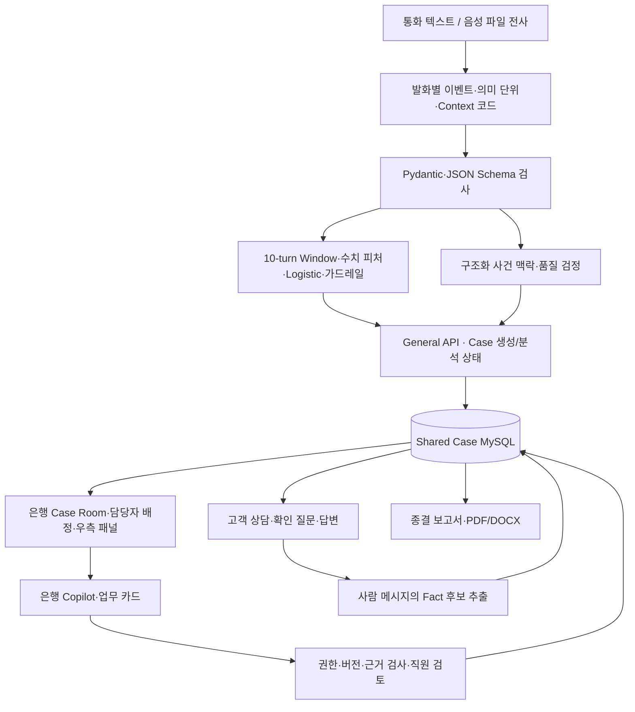

# CSR | Case Share Room — 팀 전체 포트폴리오

> 작성일: 2026-10-03  
> 수행 범위: 2026년 8월 초~10월 초, 금융 생성형 AI 웹앱 기획·개발·통합·검증·발표 준비  
> 근거: 사용자 첨부 「협업 및 구현 사항 총정리」(2026-10-02), 현재 저장소 코드(HEAD `2bee7f6e`), 구현 상태·평가·테스트 기록  
> 팀: 엄정희 · 이종열 · 함형준

## 1. 프로젝트 소개

**CSR은 보이스피싱 의심 정황이 발생한 뒤 고객과 은행 담당자가 같은 사건 맥락을 공유하고, 질문·확인·대응·처리 기록을 이어갈 수 있도록 만든 AI 기반 업무 워크스페이스다.**

통화·전사에서 추출한 사칭·압박·행동 요구·금전 신호와 ML 위험 결과를 하나의 Shared Case에 연결했다. 이후 고객 답변, 직원 확인, 기관 검증, 담당 업무와 조치 기록을 같은 사건에 누적해 현재 확인된 내용과 다음 확인할 내용을 함께 볼 수 있게 구현했다.

| 항목 | 내용 |
|---|---|
| 서비스 대상 | 은행·금융기관의 보이스피싱 대응·모니터링·상담 업무 |
| 참여자 | 고객, 은행 담당자, 고객용 안전 상담 AI, 은행용 CaseCopilot |
| 핵심 가치 | 분석 결과·대화·확인 결과·업무를 사건 단위로 연결하고 출처·확정 여부·진행 상태 보존 |
| 의사결정 방식 | AI 제안 → 시스템 검사 → 사람 검토·판단 → 업무 기록 |
| 구현 형태 | React SPA + General API + AI API + MySQL |
| 저장소 | [AIXTeamProject2](https://github.com/hamhj7694/AIXTeamProject2) |
| 상세 기술 목록 | [전체 기술 스택](전체%20기술%20스택.md) |

## 2. 해결하고자 한 문제

기획 단계에서 금융 데이터·개인정보의 접근 제한과 실제 서비스 구현 가능성을 검토했다. 보이스피싱 탐지 이후에도 담당자는 사칭 주체, 상대방 주장, 요구 행동, 고객의 실제 수행, 피해·노출, 확인할 사항을 다시 수집해야 한다는 문제에 집중했다.

| 업무 문제 | 구현한 해결 방식 |
|---|---|
| 통화 내용을 담당자가 처음부터 재해석해야 함 | Event·Context Feature·Semantic Atom과 직원용 사건 요약 |
| 송금 요구와 실제 송금이 혼재함 | 요구·실행·부인·미확인 상태 및 금액 역할 분리 |
| 대화·검증·조치가 분산됨 | Shared Case와 Fact·Question·Verification·Task·Action 원장 |
| 확인된 내용도 반복 질문함 | 최신 사건 상태·질문 이력·답변 여부를 반영하는 질문 정책 |
| 업무 책임과 진행 상태가 불분명함 | 직원 디렉터리·역할별 배정·업무 상태·결과 기록 |
| AI가 사실이나 조치 완료를 단정할 수 있음 | 출처·공개 범위·상태 검증, 직원 검토, 제한적 재생성 |

기존 FDS·ASAP·온디바이스 분석은 적용 시나리오와 후속 입력 경계로 검토했다. 실제 금융기관의 해당 API를 현재 MVP에 연결한 실적으로 표현하지 않는다.

## 3. 팀 역할과 협업 방식

| 팀원 | 첨부 기록의 초기 주 담당 | 팀 산출물과 연결되는 작업 |
|---|---|---|
| 엄정희 | Backend·Case Platform·MySQL | Case lifecycle·저장 계약·데이터 원장·migration·API와 DB 연결 |
| 이종열 | AI·ML·LLM·CaseCopilot | 분석 스키마·피처·모델 실행·맥락 재구성·Copilot·질문/업무 AI |
| 함형준 | Frontend·서비스 통합·화면 갱신·배포 | 서비스 흐름·고객/은행 UI·Context 패널·배정·AI 기능 연결·통합·문서/발표 |

위 표는 첨부에 기록된 역할 분담이다. 실제 기능별 단독 저자나 기여 비율은 전체 Git 이력을 별도로 감사하지 않았으므로 확정하지 않는다. 팀은 기획, 계약 조율, 통합 디버깅, 문서화와 발표 준비를 함께 수행했다.

Notion으로 회의록·자료실·체크리스트·역할과 일정을 관리하고, 카카오톡으로 비공식 논의·실시간 진행·긴급 수정 사항을 공유했다. GitHub의 브랜치·Commit·PR로 작업을 통합했으며 Codex로 코드·문서·테스트·계약 점검을 보조했다. 데이터·ERD·PPT·PDF는 Google Drive와 공유 폴더로 전달했다.

## 4. 프로젝트 진행 타임라인

| 기간 | 수행 내용 | 결과·결정 |
|---|---|---|
| 8월 6~7일 | 금융 주제 탐색, 데이터·개인정보·구현 범위 검토 | 보이스피싱 대응으로 방향 구체화 |
| 8월 12~19일 | CSV 전처리·중복 검토·피처 후보·분석 질문·PPT 흐름 정리 | 관찰 가능한 용어·행동·요구 중심 분석 기준 |
| 8월 24~29일 | 요구사항·제안서·B2B 포지셔닝·고객/은행 역할·아키텍처 논의 | Shared Case·Human-in-the-Loop·탐지 이후 업무 연결 |
| 8월 30일~9월 6일 | React·FastAPI·AI API·MySQL 통합, Case 목록/상세/고객 상담 | 제출용 MVP 구성; 당시 실시간 음성 통화·Streaming STT 범위 축소 |
| 9월 7~13일 | 응답 구조·UI 기대값·Case 중복·식별·환경변수·DB 점검 | 공통 계약 및 실제/Mock/미구현 경계 정리 |
| 9월 14~23일 | Context V3·채팅→Fact·질문 카드·고객/은행 AI·담당자 배정·Task/Action 통합 | 사건 맥락과 업무 처리 연결 |
| 9월 28일~10월 1일 | 현재 상태·처리 기록·Copilot·migration·종결 보고서·PPT/시연 정리 | 최종 제출용 기능·보고서·발표 자료 최신화 |
| 10월 3일 | 첨부 수행 기록과 현재 코드 대조, 팀 기술·구현 포트폴리오 작성 | 이 문서 및 전체 기술 스택 작성; 새 운영 시험은 수행하지 않음 |

시기별 활동은 첨부 기록을 따른다. 개별 기능의 코드 존재와 검증 상태는 아래에 별도로 설명한다.

## 5. 시스템 설계와 서비스 흐름

Frontend는 General API를 통해서만 AI를 사용한다. General API가 Case와 공개 범위에 맞는 입력을 조립해 AI API로 전달하고, AI 결과의 계약·대상·버전을 검사한 뒤 MySQL에 기록한다. AI API는 DB를 직접 갱신하지 않는다.

통화 분석의 수치 피처 경로와 전체 사건 맥락 재구성 경로를 구분했다. ML은 위험 신호·점수를 산출하고, LLM은 근거가 있는 사건 정보를 구조화·서술한다. 금융 조치의 최종 판단과 실제 실행은 직원과 기존 금융 시스템의 책임으로 유지한다.

## 6. 구현한 기능과 기술적 상세

### 6.1 데이터 확보·정제·위험 신호 설계

첨부 기록에는 발췌 통화 776건 확보와 자동 추출·LLM 분류를 이용한 SILVER 분석 데이터 생성이 기재되어 있다. 중복·누락·분석 가능성을 검토하고 사칭·심리 전략·행동 요구·금전 이동·금액을 이벤트로 분리했다.

피처는 이벤트 존재 여부, 반복 횟수, 신호 종류의 다양성, 금액과 신호 간 상호작용으로 설계했다. pandas·NumPy·scikit-learn과 구조화 스키마가 서비스 피처·추론 경로에서 사용된다. 전체 학습 원본, 라벨 전수 검수, 통화 단위 데이터 분할과 비교 실험의 재현은 현행 저장소 증빙만으로 확정하지 않는다.

### 6.2 Pydantic 기반 분석 계약과 의미 보존

`AnalysisEnvelope`, `ExtractedEvent`, `SemanticAtom`, `SemanticMention`, `SemanticRelation`, `ContextSignal` 등을 정의했다. Pydantic과 JSON Schema로 필드·타입·금액 범위·허용 상태·근거 turn 등을 검사한다.

Semantic Atom에는 발화자, 행동 주체, 대상, 주장된 기관·관계, 행동 상태, 금액 역할, 출처를 보존했다. 예를 들어 “검찰이라며 500만 원을 보내라고 했다”는 사칭 주장·송금 요구·요구 금액이며 실제 송금 완료로 승격하지 않는다. 고객이 “보내지 않았다”고 답하면 부인·미수행 진술을 별도로 기록한다.

정의된 범주의 `OTHER`와 정식 키에 매핑하지 못한 `UnmappedObservation`을 구분했다. 채팅 Fact 추출에서는 허용된 용어를 후보 카테고리·근거와 함께 `UNMAPPED`로 보존한다. 검토·매핑·기각을 위한 구조이며 모든 미추출 정보가 자동 복구된다는 의미는 아니다.

근거: [diagnosis.py](MVP_v3/backend/contracts/diagnosis.py), [context_fact_extraction.py](MVP_v3/backend/contracts/ai_internal/context_fact_extraction.py), [envelope.py](MVP_v3/backend/ai_api/app/domains/diagnosis/envelope.py).

### 6.3 Window Logistic 위험도 분석

발화별 이벤트를 최근 10개 발화 Window로 집계하고 Feature Builder의 결과를 모델이 기대하는 피처 이름·순서로 정렬해 `predict_proba`를 실행한다. 원점수·최종 점수·임계값·NORMAL/PHISHING·근거·가드레일·버전 정보를 반환한다.

서비스 artifact는 `WINDOW_LOGISTIC_DASHBOARD_EXPERIMENTAL_SAMPLE_v1.pkl`이다. scikit-learn 1.6.1과 SHA-256을 확인하고, 모델의 23개 입력 피처 계약을 사용한다. artifact 임계값은 0.95이며 runtime override를 지원한다. `.env.example`의 0.60과 artifact 값이 다르므로 발표 시 실제 적용 threshold를 별도로 기록해야 한다.

무신호에서는 점수를 제한하고 금전 신호만 있을 때는 추가 사기 신호 없이 위험 라벨을 확정하지 않도록 했다. 사건 대표 위험 결과는 Window 결과에서 선택하고 전체 맥락·근거와 결합한다.

근거: [features.py](MVP_v3/backend/ai_api/app/domains/diagnosis/features.py), [window_ai/service.py](MVP_v3/backend/ai_api/app/domains/diagnosis/window_ai/service.py), [model_adapter.py](MVP_v3/backend/ai_api/app/domains/diagnosis/model_adapter.py), [risk_fusion/service.py](MVP_v3/backend/ai_api/app/domains/diagnosis/risk_fusion/service.py).

### 6.4 AI·LLM 서비스 구성과 연결

팀 구현은 **고객/은행 대화 AI 2개 역할**, **분석·검정·업무·보고서 보조 7개 역할**로 설명할 수 있다. 품질 검정을 두 역할로 나누어 총 9개 LLM 역할을 집계했다. 동일 모델을 재사용하거나 단계별로 호출하는 구성으로, 별도의 학습 모델 9개를 만든 의미는 아니다.

| 역할 | 기능·연결 위치 | 상세 구현 |
|---|---|---|
| 발화 분석 | 통화 입력→Window adapter | event family·금액·행동 상태·Semantic Atom 추출 |
| 독립 맥락 코드 추출 | 데모 Envelope 생성 | Event 결과와 별도로 Context 코드·근거 turn·CLAIMED/REQUESTED/REPORTED/DENIED 추출 |
| 전체 맥락 재구성 | Envelope→직원용 분석 결과 | 구조화 정보에서 사칭·주장·요구·수법·확인 사항 서술 |
| 추출 품질 검정 | 분석 orchestration | 역할·금액·행동 상태·lineage 검사, 일부 turn 재추출 또는 사람 검토 |
| 문장 품질 검정 | Context 재구성 이후 | 구조화 사실과 문장 비교, 제한적 재생성·사람 검토 |
| 은행 CaseCopilot | 내부 채팅·초기/변경 브리핑 | 최신 Fact·검증·업무 상태 기반 답변, 허용 버튼·Task intent 출력 |
| 고객 안전 상담 | 고객 채팅 | 고객 공개 정보만 사용, 비밀값 요구·없는 기능 안내·임의 연락처·완료 주장 검사 |
| 업무 카드 | 직원 업무 작성 화면 | 질문·기관 확인·대응 업무의 구조화 초안 생성 |
| 최종 보고서 | 사건 종결·보고서 조회/export | 최신 기록·종결 메모를 12개 항목 보고서로 생성 |

명시적으로 Agent 이름을 가진 클래스는 `CaseSupportAgent`, `CustomerVerificationAgent`, `CaseUpdateAgent` **3개**, task router는 **1개**다. 이들은 규칙 기반 `MvpWorkflowService` facade다. 현재 snapshot API는 adapter가 workflow를 직접 호출하며, 세 클래스를 자율 LLM 3개가 협업하는 운영 구조로 표현하지 않는다.

고객 질문 후보 생성, 고객 답변 구조화, 채팅→Fact 추출에는 규칙 기반 코드가 함께 사용된다. 특히 `ContextFactExtractionService`는 현재 provider 호출 없이 정규식·상태 규칙으로 처리한다. 자세한 함수·모델 설정·연결 표는 [전체 기술 스택의 AI 구성](전체%20기술%20스택.md#3-aillm-구성요소는-몇-개이며-어디에-연결했는가)을 참조한다.

### 6.5 사건 기록에 근거하는 CaseCopilot과 RAG

은행 Copilot 입력은 최신 구조화 Context와 Fact·질문·Verification·Task·Action 및 허용된 대화 기록으로 구성한다. Case 내부 lexical RAG는 2·3글자 문자 n-gram TF-IDF·cosine similarity를 사용해 관련 기록을 검색하고 출처를 붙인다.

검색 전에 Case와 audience를 제한하고, 내용 지문으로 캐시를 무효화한다. 이전 AI 생성문을 사람 사실의 근거로 재사용하지 않는다. 실제 업무 상태와 질문·답변을 조립하는 경로를 공통화해 서로 다른 화면·AI가 오래된 판단을 반복하지 않도록 했다.

AI는 고객 질문·기관 확인·대응 기능을 허용 action key로 추천한다. General API와 Frontend가 대상·권한·버전·허용 목록을 검사해 기존 화면을 열거나 업무를 저장한다. Task 생성은 AI 추천 출처와 TODO 상태로 시작하며, 직원의 완료 보고·버튼과 외부 실행 증거는 구분한다.

초기 브리핑과 상태 변경 안내는 DB의 `case_copilot_jobs`에 작업을 저장하고, 상태 지문·dedupe key·lease·Case lock으로 중복을 방지한다. 외부 embedding·Vector DB·자율 금융 tool execution은 현재 사용하지 않는다.

근거: [case_retrieval.py](MVP_v3/backend/general_api/app/domains/cases/case_retrieval.py), [copilot_service.py](MVP_v3/backend/ai_api/app/domains/case_support/copilot_service.py), [copilot_tasks.py](MVP_v3/backend/general_api/app/domains/cases/copilot_tasks.py), [copilot_jobs.py](MVP_v3/backend/general_api/app/domains/cases/copilot_jobs.py).

### 6.6 사건 보드·직원 디렉터리·담당자 배정

사건 보드에 Case 요약·상태·최근 수정·새 사건을 표시하고 검색·필터·정렬·상세 접근을 제공했다. 직원 디렉터리는 이름·역할·직위·근무 상태·배정 가능 여부를 관리하며 Case 참여자와 연결한다.

최초 진입과 참여자 수정 화면에는 사건 총괄·모니터링·상담/대응·열람·인수인계 역할을 배정하는 UI가 있다. 추천은 프론트엔드에서 역할 키워드 일치, 상태, 직위, 배정 가능 여부로 후보를 선택한다. 동률은 random tie-break이며 현재 사용자·다른 역할에 선택한 인원을 제외하는 규칙을 적용한다. 직원이 선택·역할을 검토하고 저장한다.

현재 추천은 사건 위험도·유형·담당 건수·전문성 점수를 학습한 모델이 아니다. 직원 계약에도 독립 부서·전문영역·현재 업무량 필드가 확인되지 않는다. 기존 설명에 이런 조건을 넣었다면 현재 구현 실적보다 고도화 요구사항으로 표현한다.

근거: [CaseListPane.tsx](MVP_v3/frontend/src/components/CaseListPane.tsx), [BankStaffManager.tsx](MVP_v3/frontend/src/components/BankStaffManager.tsx), [CaseAssignmentDialog.tsx](MVP_v3/frontend/src/components/CaseAssignmentDialog.tsx), [bank_staff.py](MVP_v3/backend/contracts/public_api/bank_staff.py).

### 6.7 고객 질문·사실·확인·업무·조치의 원장

| 자원 | 저장·처리 내용 |
|---|---|
| Fact | 진술·추출 후보·확정·기각·대체 상태와 출처·근거·정정 이력 |
| Question | 확인 주제·문장·선택지·직원 발송·고객 답변·버전·후속 관계 |
| Verification | 확인 대상·주장·기관 확인 결과·담당자·고객 공개 여부 |
| Task | 업무 제목·상태·담당자·결과·취소/차단 사유 |
| Action | 직원 대응 기록·고객 진행 기록; 외부 시스템 실행과 구분 |
| Decision | 직원 판단·사유·근거·대체 관계 |

질문 카드의 자유 답변·선택지, 직원의 내부 확인 보고, 추가 송금·정정·정보 노출·앱 설치를 저장된 메시지 근거와 연결했다. 불확실한 답변은 UNKNOWN/미해결로 남기며, 요구받았다는 진술을 실제 실행으로 처리하지 않는다. 직원의 직접 확인 보고는 출처를 보존해 내부 업무에 활용하지만 자동으로 공식 은행 원장이나 REVIEW 확정으로 바꾸지 않는다.

### 6.8 Context V3와 우측 기록 패널

은행 화면은 현재 사건 요약 아래에 **피해·노출**, **확인·조치 진행**, **주요 사기 정황**, **처리 기록** 네 영역을 둔다. 상대방 주장·요구, 고객 진술·부인, 직원 기록·확인 보고, 공식 확인, 분석 정황·미확인을 구분한다.

피해·노출은 금전·개인정보·인증정보·기기 접근으로 나눈다. 사기 정황은 사칭·접촉, 상황 주장, 요구 행동, 압박·연락 통제를 묶는다. AI의 추천·미완료 업무와 직원 완료 기록을 분리하고, 화면 편집본·원장 사실·projection cache의 책임도 분리했다.

근거: [right_panel_projection.py](MVP_v3/backend/general_api/app/domains/cases/right_panel_projection.py), [context_v3/panel.py](MVP_v3/backend/general_api/app/domains/cases/context_v3/panel.py), [ContextPanelV3.tsx](MVP_v3/frontend/src/context-v3/ContextPanelV3.tsx).

### 6.9 파일 전사·화면 갱신·분석 상태

현재 코드에는 음성 파일 업로드→General API 프록시→AI API→OpenAI Audio Transcriptions→SSE 부분 전사→Frontend 흐름이 있다. 기본 모델 설정은 `gpt-4o-transcribe`이며, diarize 모델을 명시한 경우의 옵션도 존재한다. 한국어 숫자·금액 보존 지침, 용량·형식 검사와 연결 실패·중단 오류를 처리한다. provider·브라우저 전사 품질은 이번 문서 작성에서 새로 검증하지 않았다.

Case 상태는 5초 polling, presence는 30초 heartbeat로 갱신한다. 분석 큐는 request ID와 진행 Promise로 SPA 화면 이동 중 요청을 유지하고, 전체 분석 상태를 4초 간격으로 추적한다. 업로드 파일 전사 SSE를 실시간 통화 STT 또는 Case SSE/WebSocket 구현으로 표현하지 않는다.

근거: [audioTranscription.ts](MVP_v3/frontend/src/api/audioTranscription.ts), [AI API](MVP_v3/backend/ai_api/app/main.py), [analysisQueue.ts](MVP_v3/frontend/src/analysisQueue.ts).

### 6.10 MySQL·migration·동시성·보고서

MySQL에 Case·메시지·피처·Semantic Atom·Fact·질문·검증·업무·조치·보고서·이력을 저장했다. aiomysql 비동기 pool과 SQL transaction을 사용하고, unique key·revision·expected version·row/advisory lock·lease로 중복 처리와 동시 편집을 관리한다.

migration manifest·bootstrap 생성·DB catalog·schema 검사·백업/복원 리허설 도구를 작성했다. 2026-09-29 DB catalog에는 35개 테이블·391개 컬럼·26개 trigger·38개 FK와 위반 0건이 기록되어 있다. 이는 과거 metadata snapshot이며 현재 재검사 결과는 아니다. 현재 코드 미사용 과거 확장 테이블 2개도 포함된 수치다.

사건 종결 시 최신 사실·고객 영향·검증 결과·처리 내역·미확인 사항·판단 근거·후속 업무를 12개 항목으로 생성해 FINAL 보고서에 저장하는 코드가 있다. General API에서 python-docx와 ReportLab으로 DOCX/PDF를 출력한다.

근거: [DB_CATALOG.md](MVP_v3/database/DB_CATALOG.md), [migration 목록](MVP_v3/backend/migrations/README.md), [최종 보고서 서비스](MVP_v3/backend/ai_api/app/domains/case_support/final_report_service.py), [General API](MVP_v3/backend/general_api/app/main.py).

## 7. 테스트·검증 결과와 해석

| 검증 종류 | 저장된 기록·현재 도구 | 해석 |
|---|---|---|
| AI API 회귀 | CURRENT_STATUS 2026-09-29 절에 `378 passed, 183 subtests passed` | 해당 실행 시점 계약·로직 통과. 이후 변경 포함 최신 전수 결과로 일반화하지 않음 |
| General API 비통합 회귀 | 같은 절에 `307 passed, 69 subtests passed` | 해당 시점 회귀 기록; 실제 DB·브라우저 전체 운영 성능과 구분 |
| 격리 MySQL 통합 | 별도 2026-09-29 절에 repository 18 passed, normalization 10 passed/14 subtests | 별도 suite와 실행 시점. 위 수치에 임의로 합산하지 않음 |
| Frontend | Vitest 9 files/32 tests, typecheck·production build 기록 | 당시 UI 로직·타입·빌드 검사. 모든 화면 browser E2E 통과 의미는 아님 |
| DB 점검 | catalog·migration·FK/orphan 검사 기록 | 기록 시점의 구조·참조 무결성 확인 |
| CI | Analysis Envelope Guard workflow | 계약·Case·MySQL·Frontend·diff 검사 자동화 설정 |
| 실 LLM·브라우저 | provider 오류, browser surface 부재, NOT RUN 기록도 존재 | 완료된 회귀 검사와 미완료 운영 검증을 함께 보존 |

위 수치는 이번 문서 작성에서 재실행하지 않은 **과거 검증 기록**이다. 테스트 개수와 ML/LLM 의미 품질 점수를 혼합하지 않는다.

ML의 저장된 로컬 fallback replay는 30 Case/160 event 시나리오이며 HIGH 10건 Recall 100%, HIGH/LOW Precision 50%, F1 66.7% 기록이 있다. LOW 10건도 위험으로 분류되었으므로 일반화된 운영 탐지 성능으로 쓰지 않는다. `0.95`는 모델 artifact threshold다.

v3.1의 raw 30-case 출력과 실행 성공·token·지연 지표가 있어도 Context/Numeric/Fact precision·recall 및 contradiction·hallucination은 동일 정답·projection·evaluator로 검증해야 한다. 가점수·예상 시뮬레이션은 실제 측정 실적에 포함하지 않는다.

근거: [현재 상태 기록](MVP_v3/docs/CURRENT_STATUS.md), [ML 팩트체크](01_docs/01_proposal/CSR_ML_보이스피싱_위험도분석_PPT원고_팩트체크.md), [benchmark](replay_benchmark/README.md).

## 8. 실제 구현 범위와 후속 과제

| 범위 | 현재 확인 내용 | 후속 과제 |
|---|---|---|
| 고객·은행 웹앱 | 화면·API·원장 연결 코드 | 최신 전체 브라우저 시나리오 재검증 |
| LLM·ML | SDK·역할별 prompt·schema·artifact·품질 검정 | 독립 정답셋·정량 의미 품질·오탐/미탐·실 provider 회귀 |
| RAG | Case 내부 lexical 검색 연결, 외부 공식자료 검색 별도 실험 | 외부 지식 연동·운영 corpus·Vector DB 필요성 평가 |
| 음성 | 업로드 파일 전사와 SSE 전달 코드 | 컨테이너 COPY 누락 등 배포 정합성·실 provider 품질 확인, 통신사/실시간 통화 연동 |
| 데이터 보안 | 고객/은행 공개 범위, 원문·구조화 정보 경계 | 운영 로그인·세션·RBAC·보존 정책·Envelope-only 공개 생성 API |
| 외부 업무 | 확인·거래·대응 기록·UI | 실제 기관 확인·은행 원장·FDS/ASAP·지급정지 API 연동 |
| 배포 | Docker·Nginx·Compose·healthcheck·RDS 설정 안내 | 실제 배포 로그·서비스 설정·Secret 주입·운영 인증 검증 |
| 동기화 | HTTP polling·presence | 필요 시 Case event SSE/WebSocket |

데모 초기 입력은 `case_inputs.input_text`에 저장된다. 이후 지원 AI에는 필요한 구조화 정보만 조립하는 경계를 적용했으므로 “원문을 전혀 저장하지 않는다”라고 설명하지 않는다. 채팅 첨부파일 API는 현재 retired(410)이며 음성 분석 업로드와 별개다.

## 9. 별도 개인 실험·팀 수행 이력의 취급

첨부에는 함형준 개인 수행 이력으로 영상·음원 513건 다운로드 RPA, faster-whisper 전사, pyannote 화자 분리, 위험도 ML 학습·검토가 기재되어 있다. 현재 서비스 런타임과 분리해 소개하고, 도구명·수량·실험 결과는 실행 로그·노트북·원본 목록을 확보한 범위에서 확정한다.

발췌 통화 776건과 RPA 다운로드 513건은 동일한 단위·모집단이라는 증거가 없으므로 합산하지 않는다. n8n 알림 workflow 계획, Airbyte 미사용 기록, Vector DB·온프레미스 구상도 완료 실적으로 합산하지 않는다.

## 10. 팀 포트폴리오용 소개문

> 우리 팀은 보이스피싱 의심 정황이 발생한 뒤 은행 담당자의 사건 파악과 대응 업무가 이어지도록 CSR(Case Share Room)을 개발했습니다. React·TypeScript 기반 고객/은행 화면, FastAPI General API와 AI API, MySQL Shared Case 원장을 구성하고, 통화 이벤트 추출·Window Logistic 위험 분석·사건 맥락 재구성을 연결했습니다. 고객 안전 상담 AI와 은행 CaseCopilot, 품질 검정·업무 카드·최종 보고서 등 역할별 LLM 서비스를 구현했으며, 질문·기관 확인·담당 업무·조치·처리 이력을 한 사건에 누적했습니다. Pydantic 계약, 출처와 공개 범위 검사, 버전·중복 방지, Case 내부 RAG와 직원 검토를 통해 분석·제안이 사람이 검토할 수 있는 업무 정보로 이어지도록 설계했습니다. 팀은 GitHub·Notion·카카오톡 기반 협업으로 기획부터 통합·회귀 검사·실행 구성·보고서와 발표 준비까지 수행했습니다.

## 11. 산출물과 근거 목록

| 산출물 | 확인 위치 |
|---|---|
| 팀 기술 목록·LLM 역할/개수·모델 설정 | [전체 기술 스택](전체%20기술%20스택.md) |
| 서비스 실행 구조·설치·환경설정 | [MVP_v3 README](MVP_v3/README.md) |
| 실제 구현·회귀·미완료 검증 기록 | [CURRENT_STATUS](MVP_v3/docs/CURRENT_STATUS.md) |
| 제품·고객 요구사항 | [PRD](MVP_v3/PRD.md), [CUSTOMER_PRD](MVP_v3/CUSTOMER_PRD.md) |
| 공용 데이터 계약 | [contracts](MVP_v3/backend/contracts) |
| 온디바이스·통신사 입력 연동 명세 | [36_ON_DEVICE_ANALYSIS_DATA_HANDOFF](MVP_v3/docs/36_ON_DEVICE_ANALYSIS_DATA_HANDOFF.md) |
| 고객/은행 Frontend | [frontend/src](MVP_v3/frontend/src) |
| AI 분석·업무 구현 | [ai_api/app/domains](MVP_v3/backend/ai_api/app/domains) |
| Case 저장·업무·projection 구현 | [general_api/app/domains/cases](MVP_v3/backend/general_api/app/domains/cases) |
| DB 구조·migration | [DB catalog](MVP_v3/database/DB_CATALOG.md), [migration README](MVP_v3/backend/migrations/README.md) |
| 자동 검사·실행 구성 | [CI workflow](.github/workflows/analysis-envelope-guard.yml), [Compose](MVP_v3/docker-compose.yml) |
| ML 평가 표현 기준 | [ML PPT 팩트체크](01_docs/01_proposal/CSR_ML_보이스피싱_위험도분석_PPT원고_팩트체크.md) |
| 별도 공식자료 검색 | [rag/service](ai_system_design/rag/service/rag_service.py) |
| 팀 수행 타임라인·초기 역할·협업 도구 | 사용자 첨부 「협업 및 구현 사항 총정리」(2026-10-02) |

외부 자료는 첨부에 기록된 범위로 사용했다. 이번 작성에서는 Notion·카카오톡 원본 전체 재조회나 Git 전체 저자 감사를 수행하지 않았다. 서비스·DB·배포 상태를 변경하지 않고 두 문서에 코드와 기록을 대조한 결과를 남겼다.
